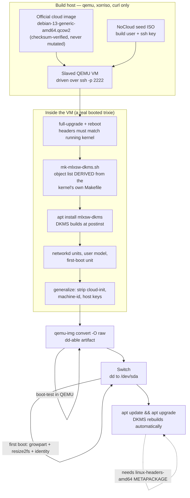
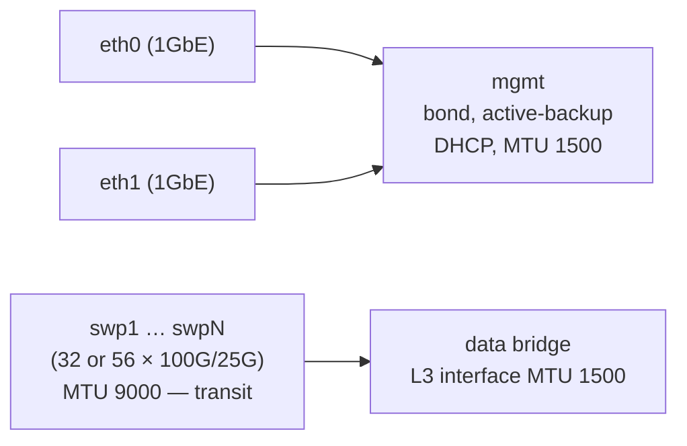

# mlnx-sw-os — Architecture

An open-source Debian image builder for Mellanox Spectrum-ASIC switches.

**Status:** 2026-08-01. Debian 12 is proven in the field on SN2410 and SN2700.
The Debian 13 (trixie) driver path is now **proven up to module load**: mlxsw
builds out-of-tree against trixie's 6.12.100 with **zero source patches**, and
the resulting DKMS package installs and loads under QEMU. Port enumeration
remains a hardware-only assertion.

This document describes the architecture for the trixie rebuild and records the
evidence behind each decision.

---

## 1. Purpose and scope

Take retired, formerly Cumulus-licensed Mellanox enterprise switches and run
pure upstream Debian on them, with a build process that is repeatable,
scriptable, and maintainable as open source.

**In scope**

- Producing a bootable Debian image containing the `mlxsw` switchdev drivers
- Both **BIOS** and **UEFI** boot paths
- Automated OS configuration (console, networking, sensors, SSH)
- A kernel/driver upgrade path that does **not** require re-imaging

**Out of scope (for now)**

- Control-plane routing software (FRR, BGP) — the image is a foundation
- Switch firmware (ASIC) updates
- An Arch-based switch OS **as a deliverable**. Debian is the target and the
  only distro that will be built and tested.

**But not multi-distro *capability*.** Reversed 2026-08-01. The pipeline
confines distro-specific logic to a base-image URL and the package-install
commands, so a rolling Arch base stays reachable without a rewrite. That
constraint is the reason the builder is not written around a Debian-only
bootstrapper — see AD-3.

## 2. Target hardware

| Model | ASIC | PCI ID | Ports | Boot | Status |
|---|---|---|---|---|---|
| SN2410 (MSN2410-BB2FC) | Spectrum | `15b3:cb84` | 48×25G + 8×100G (56 `swp`) | BIOS | ✅ in service |
| SN2700 (MSN2700) | Spectrum | `15b3:cb84` | 32×100G | BIOS | ✅ in service |
| SN3700C | Spectrum-2 | `15b3:cf6c` | 32×100G | UEFI (believed) | ⏳ untested |

All units share the same CPU complex: **Intel Celeron 1047UE @ 1.40 GHz,
2 cores, 7.9 GB RAM, 512 GB SATA SSD.** This is the build target for any
on-switch compilation, and it is slower than it looks — but see §4.1.

A single `mlxsw_spectrum` build covers the whole fleet: the driver registers
PCI aliases for `cb84` (Spectrum), `cf6c` (Spectrum-2), `cf70` (Spectrum-3)
and `cf80` (Spectrum-4). Port-count differences are absorbed entirely by a
`Name=swp*` glob in the network config — no per-model image is needed.

## 3. The central constraint

**Debian does not ship the mlxsw driver.** Every stock Debian kernel carries:

```
# CONFIG_MLXSW_CORE is not set
```

Verified two ways: on the live SN2700's `/boot/config-6.1.0-51-amd64`, and in
Debian's current `debian/latest` packaging branch on salsa — so this is not a
bookworm-era quirk and it will still be true for trixie.

Everything mlxsw *depends* on, however, Debian already enables:

```
CONFIG_NET_SWITCHDEV=y          CONFIG_NET_DEVLINK=y
CONFIG_BRIDGE_VLAN_FILTERING=y  CONFIG_PSAMPLE=m
CONFIG_VLAN_8021Q=m             CONFIG_VXLAN=m
CONFIG_NET_IPGRE=m              CONFIG_IPV6_GRE=m
CONFIG_MLXFW=m                  CONFIG_PTP_1588_CLOCK=y
```

The only additional gaps are `objagg` and `parman` — `lib/` helpers that
Debian omits because *only* mlxsw selects them.

**Therefore: producing mlxsw is a mandatory, first-class stage of the
pipeline.** Every architectural decision below follows from this one fact.

## 4. Architecture decisions

### AD-1 — Driver delivery by DKMS, not a forked kernel

**Decision.** Ship stock Debian kernels untouched. Deliver mlxsw as a DKMS
source package that rebuilds against whatever kernel `apt` installs.

**Rejected alternative.** Rebuilding Debian's kernel with `MLXSW_*` enabled
(the Debian 12 approach, producing `6.1.85-mlnx`). It works, but it forks the
kernel: every Debian security update must be re-forked by hand, and in
practice the fork froze at `6.1.85` while Debian moved to `6.1.177`.

**Evidence.** Tested end to end on `mlnx-2700-cameo`, 2026-08-01:

| Check | Result |
|---|---|
| Builds OOT against stock kernel headers | ✅ **zero source patches** |
| Clean build, `-j2`, on the switch itself | **1 m 47 s** |
| Unresolved symbols (modpost vs stock `Module.symvers`) | none |
| Modules load on stock `6.1.0-51-amd64` | ✅ all 7 |
| `swp*` interfaces, driver-bound to `mlxsw_spectrum` | ✅ 32/32 |
| devlink / switchdev offload live | ✅ per-port lanes reported |
| Thermal + fan control (`MLXSW_CORE_THERMAL`) | ✅ 2 fans |
| Bond, bridge, addressing after reboot | ✅ 36 links configured |

The 1 m 47 s figure is the load-bearing one: it makes an automatic rebuild on
every `apt upgrade` completely unremarkable. The intuition that "the switch is
too slow to build drivers" conflates this with a *kernel* build — mlxsw is
49 `.c` files and ~67 k lines, not 30 000 files.

**Status: DEPLOYED (2026-08-01).** `mlxsw-dkms_6.1.177-1_all.deb` (338 KB) is
built and installed on both live switches. The forked `6.1.85-mlnx` kernel is
removed and unheld on each; GRUB defaults to the newest stock kernel; and
`/etc/kernel/postinst.d/dkms` plus `AUTOINSTALL="yes"` mean a future kernel
install rebuilds mlxsw automatically. Rollback debs are staged at
`/opt/packages/` on both switches, so reverting needs no network.

| | SN2700 | SN2410 |
|---|---|---|
| kernel | stock `6.1.0-51-amd64` | stock `6.1.0-51-amd64` |
| apt holds | 0 | 0 |
| `swp` ports / bridged | 32 / 32 | 56 / 56 |
| DKMS rebuild time | 1 m 47 s | 1 m 52 s |
| failed units | 0 | 0 |

Package generator: `scripts/mk-mlxsw-dkms.sh`. Built artifact:
`mlnx-switch-packages/dkms/`.

**Status on trixie: PROVEN, 2026-08-01.** The series bump was carried out and
the zero-patch property holds:

| Check on trixie `6.12.100+deb13-amd64` | Result |
|---|---|
| Builds OOT against stock trixie headers | ✅ **zero source patches** |
| Compiler errors / warnings | 0 / 0 |
| `modpost` undefined symbols | none — silent |
| Modules produced | 7 of 7, vermagic exact incl. `+deb13` |
| DKMS build at `postinst`, `modprobe`, taint 12+13 | ✅ (see §9) |

Zero patches was **verified, not asserted**: `diff -rq` between Debian's
shipped `drivers/net/ethernet/mellanox/mlxsw/` and the packaged tree reports no
content differences. AD-1's load-bearing rationale therefore survives the
series bump — there is no patch queue, so the argument that DKMS beats a
kernel fork is unchanged.

The object list is no longer transcribed by hand. `scripts/mk-mlxsw-dkms.sh`
**derives** it from the kernel's own shipped `Makefile`, and
`tests/test-derive.sh` regression-tests the derivation against the package
deployed on the live fleet. The source snapshot still tracks a kernel series,
so a series bump still means re-running the generator against the matching
`linux-source` — but the list itself cannot silently go stale.

🔴 **DKMS delivery has a hard prerequisite: the `linux-headers-amd64`
METAPACKAGE must be installed — never a versioned
`linux-headers-<uname -r>`.** See R4; this was demonstrated to fail, silently,
in exactly the way that leaves a switch with no ports.

**Consequences.**

- Debian security updates flow normally; the driver follows the kernel.
- Cost: ~78 MB of kernel headers and ~500 MB of build tooling resident on each
  switch. Irrelevant against a 512 GB SSD (see AD-4).
- Risk: a failed rebuild yields a kernel with no switch ports. Mitigated —
  management is a bond over *stock* NIC drivers, so SSH always survives, and
  the previous kernel remains installed and bootable.
- Modules are unsigned and out-of-tree (taint bits 12 + 13). **This blocks
  Secure Boot**; see §8.

### AD-2 — A private apt repository is the delivery channel

**Decision.** Publish `mlxsw-dkms` (and any custom packages) from an apt repo
the switches subscribe to.

**Rationale.** This is what actually retires re-imaging, and it is needed
regardless of AD-1. Re-imaging was never a consequence of building a custom
kernel — a kernel `.deb` installs into `/boot` and runs `update-grub` like any
package. The real gap was that there was nowhere to `apt install` *from*.

Two-thirds of this already exists: `assets/setup.sh` builds a local repo
(`deb [trusted=yes] file:/opt/packages/ ./`) and `assets/update.sh` regenerates
its indices with `dpkg-scanpackages`. The change is to promote it from a
throwaway `file:` repo to a published, signed HTTP repo.

> The live switches already prove multi-kernel coexistence: the SN2410 has
> seven kernel packages installed side by side, with `/boot` on the root
> filesystem, so there is no small boot partition to overflow.

### AD-3 — Customize an official cloud image in a slaved VM

**Superseded the mmdebstrap design, 2026-08-01.** The previous decision was to
assemble a root filesystem directly with `mmdebstrap`. It works, but a pipeline
*written around* a distro-specific bootstrapper makes a rolling Arch base
impossible without a rewrite (see §1).

**Decision.** Start from an **official distro cloud image**, boot it under QEMU
with an SSH key injected via a cloud-init **NoCloud** seed ISO, and drive it
over plain `ssh`. Implemented as `scripts/vm.sh`.

An image builder has four layers and only the first is distro-specific:

| Layer | Distro-specific? |
|---|---|
| Obtain a root filesystem | **yes** (`mmdebstrap` / `pacstrap` / …) |
| Install packages, write configs, create users | no — it is a shell session |
| Partition, mkfs, copy, install bootloader | no |
| First-boot growth and identity | no — one systemd unit |

This approach **deletes layer 1** rather than abstracting it. Swapping
Debian → Arch becomes a base-image URL plus different package commands.

🔴 **Use the `generic` variant — NOT `nocloud`, and NOT `genericcloud`.**
Measured 2026-08-01:

| Variant | cloud-init | Drivers | Verdict |
|---|---|---|---|
| `nocloud` | **removed** | virtual-only | **cannot be driven over ssh** — the name means "no cloud-init", not "the NoCloud datasource". Booting it logged zero cloud-init and zero sshd lines and sat at a first-boot prompt until the readiness poll expired; the seed ISO is never read because nothing reads it. |
| `genericcloud` | present | **reduced set, built for VMs** | the artifact is `dd`'d onto *physical* switches — a trimmed driver set is a direct boot risk |
| **`generic`** | present | **full**, bare metal listed as a target | ✅ the only variant satisfying both halves |

Both halves pull in opposite directions: the pipeline needs cloud-init *in the
VM* to inject the build key, and the artifact needs a full driver set *on real
hardware*.

**Consequences.**

- No console automation problem and no interactive installer.
- **Build-host dependencies are QEMU, xorriso and curl.** No bootstrapper, no
  Debian archive keyring on an Arch workstation, no cross-distro packaging
  tooling. (`genisoimage` is not packaged on Arch; `xorrisofs` takes the same
  options.)
- The DKMS build collapses into the pipeline — the VM already has the right
  kernel, headers and toolchain, so the mlxsw package is built and installed
  there rather than as separate scaffolding.
- The bootloader comes from the base image rather than being installed by the
  build host, which disposes of the old hazard of running an Arch `grub-install`
  against a Debian target.

### AD-4 — Small image, grown on first boot

**Decision.** Build a lean (~8 GB) image. A oneshot systemd unit runs
`growpart` + `resize2fs` on first boot to fill whatever disk it landed on,
then disables itself.

**Rationale.** `dd` time is proportional to image size, and target disks vary.
Today the fleet wastes ~98% of its storage: both switches ran 6.9 GB
filesystems on 512 GB SSDs, and the manual fix is a `sgdisk` sequence
surviving only as a comment block in `deb12_image_builder.sh:118-134`.

> Applied to `mlnx-2700-cameo` on 2026-08-01: `resize2fs` grew it from
> 6.9 G → 469 G online, no reboot. `mlnx-2410-cameo` still needs a partition
> grow first because its partition really is 7 GB.

🔴 **Precondition, without which AD-4 cannot work: root must be the LAST
partition on disk, and swap must be a FILE, not a partition.** This is the
binding constraint — installing growth tooling is the easy half.

| | 2410 | 2700 |
|---|---|---|
| layout | `sda1` root, last partition | `sda1` root, **`sda2` swap after it** |
| swap | 2 G swapfile | 961 M partition |
| growable in place? | **yes** | **no** |

The 2700 is 476 G because it was *imaged* that way, not because anything grew
it. The 2410's 2026-08-01 repartition — delete the swap partition and its
extended container, then extend root — was the layout rule being learned the
hard way, not a one-off repair.

**The failure mode is silent.** Ship a swap partition after root and the tool
runs, declines, and you get an 8 GB switch on a 512 GB SSD with nothing in the
logs shaped like an error.

The `generic` base image already satisfies this: root is `vda1` but starts at
sector 262144, *after* `vda14` (bios_grub) and `vda15` (ESP). Debian numbers
them that way on purpose. Any check that sorts by partition **number** rather
than **start sector** reports the wrong answer.

**Tooling: `growpart` (from `cloud-guest-utils`) + `resize2fs`.** Chosen for
GPT backup-header relocation and for covering MBR *and* GPT, so the choice
survives however the base image's label lands. Arch packages
`cloud-guest-utils` too, so this does not compromise §1. `systemd-repart` was
rejected as GPT-only.

Two traps, both verified:

- `cloud-guest-utils` is a **`Recommends` of `cloud-init`**, which the pipeline
  purges when it strips cloud-init. `apt autoremove` will then take `growpart`
  with it. Install it explicitly *after* the purge, or `apt-mark manual` it
  before, and assert its presence on the finished artifact.
- `growpart` exits **1** for both "no space" *and* "no change". A first-boot
  unit that treats exit 1 as failure will fail on any disk the image already
  fills. Tolerate exit 1 deliberately — but not exit 2, which is a real error.

**Package budget.** DKMS requires a compiler, kernel headers and kernel source
resident on **every switch**: `linux-headers-*` hard-depends on the kernel
image and on `gcc-14`, and `linux-source-<series>` is a ~149 MB tarball on
trixie. The "lean ~8 GB image" must budget for all of it. This is already true
of the deployed fleet, but it constrains the target rather than being free.

### AD-5 — One generic image per boot mode; identity at first boot

**Decision.** Produce **one artifact per boot mode** with no per-switch
identity baked in. Hostname, MAC addresses and addressing are derived at first
boot (DHCP, DMI product name/serial).

⚠ **"Two artifacts" may be wrong — it may be one.** The `generic` base image is
GPT carrying **both** a 3 MB `bios_grub` partition and a 124 MB EFI System
partition, so a single image can plausibly boot BIOS (SN2410/SN2700) *and* UEFI
(SN3700C). That would simplify the pipeline and narrow R3. Confirm deliberately
before designing around either answer.

Identity derivation needs no extra package: `/sys/class/dmi/id/*` is readable
without `smbios-utils` or `dmidecode`.

**Rationale.** The current configs hardcode MACs
(`22-mgmt-bond.network`: `36:d5:b1:94:cb:52`, `32-data.network`:
`7c:fe:90:ff:92:7d`). That works for exactly one switch; ship it to two and
they collide on the same L2 segment.

## 5. Build pipeline



The dotted edge is the point of the whole design: once a switch is imaged, it
never needs imaging again. Kernel and driver updates arrive through apt.

## 6. Runtime network model

Two independent planes, both already proven in the field:



- **Management plane** — an `active-backup` bond over the two 1 GbE ports.
  Critically, these use *stock in-tree NIC drivers*, so management survives any
  mlxsw failure. This is what makes AD-1's risk acceptable.
- **Data plane** — all `swp*` ports enslaved to a `data` bridge, matched by
  glob so 32-port and 56-port models share one config.
- Port naming comes from a udev rule keying on the driver:
  `SUBSYSTEM=="net", DRIVERS=="mlxsw_spectrum*", NAME="sw$attr{phys_port_name}"`.

🔴 **MTU: the bridge's own L3 interface is 1500; `swp*` stay 9000.** Corrected
2026-08-01 — the diagram previously showed 9000 for both, which was wrong and
was live on hardware.

A bridge netdev's MTU is a **host** property, not a switching property. The
`10.10.100.0/22` segment carries ~35 hosts at 1500, and there is no path-MTU
discovery for *on-link* neighbours — a sender simply uses its interface MTU and
transmits. A jumbo `data` interface therefore emitted frames the gateway
physically could not receive, silently. Demonstrated before the fix: a
1472-byte payload passed, 9000 failed.

`swp*` at 9000 is correct and must stay — those are transit ports, and letting
jumbo frames pass through costs nothing.

Raising the *gateway* to jumbo instead would have been far worse: it would put
the other ~33 hosts behind the same blackhole in the reverse direction.

**Both planes must also take DHCP route metrics that keep `mgmt` preferred.**
`mgmt` and `data` sit on the *same* subnet, so as shipped (data 100, mgmt 500)
the data bridge won egress and the management plane became hostage to
switch-port carrier state. Data is now 1000/2000 (v4/v6), mgmt 500.

## 7. The mlxsw-dkms package specification

Measured on both kernel series, 2026-08-01. The package requires **no patches**
on either:

| | bookworm 6.1.177 | trixie 6.12.100 |
|---|---|---|
| mlxsw `.c` files | 49 | **50** |
| mlxsw objects | 49 | **50** (`+spectrum_port_range.o`) |
| `.c` + `objagg` + `parman` shipped | 51 | **52** |
| headers shipped | 32 | **33** |
| modules produced | **7** | **7** — unchanged; the new object links into `mlxsw_spectrum.ko` |
| package size | 338 KB | **351 KB** |

The **module count does not change**, so counting modules will never detect a
missing object. Only `modpost` will.

The object list is **derived from the kernel's own `Makefile`**, not
transcribed — see AD-1. Four conditional lines must be honoured, and three of
their four `CONFIG_` symbols are **absent from Debian's config entirely**
(select-only symbols kconfig omits), so a resolver that reads only the kernel
config silently drops `core_hwmon.o` and `core_thermal.o` — the fan and thermal
control:

```make
mlxsw_core-$(CONFIG_MLXSW_CORE_HWMON)       += core_hwmon.o
mlxsw_core-$(CONFIG_MLXSW_CORE_THERMAL)     += core_thermal.o
mlxsw_spectrum-$(CONFIG_MLXSW_SPECTRUM_DCB) += spectrum_dcb.o
mlxsw_spectrum-$(CONFIG_PTP_1588_CLOCK)     += spectrum_ptp.o
```

Only `PTP_1588_CLOCK` comes from the kernel config; the other three resolve
from this package's own `-D` macros.

⚠ **On trixie, modules install compressed as `.ko.xz`**
(`CONFIG_MODULE_COMPRESS_ALL=y`); bookworm ships plain `.ko`. Any tooling that
globs `*.ko` breaks.

Contents:

| Component | Source | Why |
|---|---|---|
| `drivers/net/ethernet/mellanox/mlxsw/*` | linux-source | the driver, 49 `.c` files |
| `lib/objagg.c`, `lib/parman.c` | linux-source | Debian omits them; only mlxsw selects them |
| `include/linux/{objagg,parman}.h` | linux-source | absent from the headers package |
| `include/trace/events/objagg.h` | linux-source | `objagg.c` does `#define CREATE_TRACE_POINTS` |
| `mlxfw.h` | linux-source | mlxsw does `#include "../mlxfw/mlxfw.h"`; Debian ships the `.ko` but not the header |

Plus config macros, because `CONFIG_MLXSW_*` is absent from the stock kernel's
`autoconf.h`, so the driver's `IS_ENABLED()` guards would silently compile out:

```make
ccflags-y += -I$(src)/include \
  -DCONFIG_MLXSW_CORE_MODULE=1 -DCONFIG_MLXSW_PCI_MODULE=1 \
  -DCONFIG_MLXSW_I2C_MODULE=1  -DCONFIG_MLXSW_SPECTRUM_MODULE=1 \
  -DCONFIG_MLXSW_MINIMAL_MODULE=1 \
  -DCONFIG_MLXSW_CORE_HWMON=1  -DCONFIG_MLXSW_CORE_THERMAL=1 \
  -DCONFIG_MLXSW_SPECTRUM_DCB=1 \
  -DCONFIG_OBJAGG_MODULE=1     -DCONFIG_PARMAN_MODULE=1
```

Resulting modules: `mlxsw_core`, `mlxsw_pci`, `mlxsw_i2c`, `mlxsw_spectrum`,
`mlxsw_minimal`, `objagg`, `parman`. Autoloading works via the PCI alias.

## 8. Open risks

| # | Risk | Status |
|---|---|---|
| R1 | **Trixie's 6.12 kernel is unproven.** | ✅ **Largely closed 2026-08-01.** Builds with zero patches, silent modpost, 7/7 modules with exact vermagic; DKMS builds at `postinst` and `modprobe` succeeds under QEMU. **Remaining:** port enumeration on real silicon, which QEMU cannot test. |
| R2 | **Secure Boot vs unsigned modules.** | **Narrowed twice.** Trixie ships `CONFIG_MODULE_SIG=y` with `MODULE_SIG_FORCE` **unset**, so unsigned OOT modules load and merely taint (12+13). Further, trixie's DKMS now **auto-generates a MOK and signs modules** (`/var/lib/dkms/mok.key`; `modinfo -F signer` → *"DKMS module signing key"*). So enabling Secure Boot is **MOK enrollment**, not building a signing pipeline. ⚠ Each machine generates its **own** key at first install — a fleet image must choose per-switch enrollment or a shared baked key. |
| R3 | **SN3700C entirely untested** — Spectrum-2 silicon, UEFI boot, no unit yet imaged. | Blocked on hardware time. Possibly narrowed: the base image carries both `bios_grub` and an ESP (see AD-5). |
| R4 | **Boot-with-no-ports** after a kernel upgrade. | 🔴 **OBSERVED, not theoretical — 2026-08-01.** Reproduced end to end in the VM (see §9). Mitigated by the stock-driver management plane and the retained previous kernel, but requires: the **`linux-headers-amd64` metapackage** (mandatory, see below), an **explicit GRUB fallback policy** (no longer optional), and ideally a post-upgrade assertion. |
| R5 | **No automated verification exists.** | **Partly closed.** `tests/test-derive.sh` (23 assertions) and `scripts/mlxsw-premise-audit.sh` (26 assertions, runs against the VM *or* a live switch, read-only) are automated. Image boot-testing is still manual. |
| R6 | 🔴 **Trixie has NO stable kernel ABI number.** Bookworm's `6.1.0-51-amd64` holds across point releases; trixie moved `6.12.94 → .96 → .100` inside this project's own timeline. `uname -r` changes on **every** kernel update, so DKMS rebuilds every time — each one an R4 opportunity. | Open. This is a real argument against AD-1 that did not exist on 6.1 evidence. **Never hardcode a point release** anywhere in the tooling. |

### R4 in detail — the failure that was reproduced

The mechanism, demonstrated in the build VM on 2026-08-01:

1. A system running kernel *N* has only the **versioned**
   `linux-headers-<N>` installed.
2. `apt full-upgrade` installs kernel *N+1*. No matching headers arrive,
   because the versioned package tracks *N* and nothing pulls *N+1*'s.
3. `/etc/kernel/postinst.d/dkms` fires, has nothing to build against, and
   produces nothing. **`apt` exits 0. Nothing warns.**
4. The next reboot selects *N+1*:
   `modprobe mlxsw_spectrum → FATAL: Module not found`.

On a switch that is **no data plane**, reachable only over the management bond,
discovered only by absent ports.

**The fix is a one-word difference and it is mandatory:** install
**`linux-headers-amd64`** — the metapackage — never
`linux-headers-$(uname -r)`. The metapackage tracks `linux-image-amd64`, so
headers arrive in the same transaction as the kernel and DKMS rebuilds
unattended. Verified: installing it triggered an immediate unattended rebuild
and restored `modprobe`.

✅ **The deployed fleet is not exposed** — checked, not assumed. Both switches
carry `linux-headers-amd64` 6.1.177-1 matched to `linux-image-amd64` 6.1.177-1.

## 9. Verification strategy

**Automated today** (no hardware, no network, no VM for the first):

| Harness | Assertions | Scope |
|---|---|---|
| `tests/test-derive.sh` | 23 | The derived object list must reproduce the package deployed on the live fleet, exactly. Also covers the absent-vs-disabled CONFIG trichotomy and hard-fail on unaccounted symbols. |
| `scripts/mlxsw-premise-audit.sh` | 26 | Every premise the packaging depends on, against whatever kernel the machine runs. Read-only, so it runs in the VM **or** against a live switch. Green on 6.12.100 and on the fleet's 6.1.0-51. |
| `scripts/vm.sh {up,provision,probe,audit}` | — | Brings up the slaved VM, reconciles kernel/headers, and records what the guest actually is. |

**Verified by hand in the VM, 2026-08-01** (Phase 3/4 of the trixie proof):
compile clean and modpost silent; 7/7 modules with exact vermagic; DKMS builds
at `postinst`; `modprobe mlxsw_spectrum` pulls `mlxsw_pci`, `mlxsw_core`,
`objagg`, `parman`; taint exactly 12+13; `systemctl --failed` empty; and the R4
upgrade failure reproduced and fixed.

⚠ Note QEMU has **no emulated Spectrum ASIC**, so `mlxsw_pci` binds nothing and
**no `swp*` interfaces appear**. Everything above proves symbol resolution,
module init and the upgrade path — never port enumeration.

Still manual. The target is a boot-test harness that runs in QEMU against
every built artifact and asserts:

1. The image boots to a login prompt on serial console (both BIOS and UEFI).
2. `mlxsw_spectrum` loads — verifiable in QEMU only up to module load, since
   there is no emulated Spectrum ASIC. Full port enumeration requires hardware.
3. First-boot growth ran and the root filesystem filled the disk.
4. Identity derivation produced a unique hostname and no hardcoded MACs.
5. `systemctl --failed` is empty.

Hardware-only assertions (port count, devlink, thermal) stay a documented
manual checklist against a live switch.

## 10. Known defects in the current tree

Verified 2026-08-01, all still unfixed. These are inherited from the Debian 12
process and should not be carried into the Trixie rebuild:

| Location | Defect |
|---|---|
| `assets/setup.sh:52` | A stray `gg`. With `set -e` at the top, the script aborts here — so `systemctl enable systemd-networkd` and `systemd-resolved` (lines 53–54) **never run**. |
| `assets/etc.systemd.network/24-mgmt-bond.network` | Two `[Match]`/`[Network]` pairs in one file. systemd *merges* duplicate sections, so last-wins silently discards `Bond=mgmt-bond` (which names a nonexistent netdev) and `PrimarySlave=true`. Enslavement works by accident; active-backup never gets its primary. Should be two files. |
| `22-mgmt-bond.network`, `32-data.network` | Hardcoded MAC addresses — see AD-5. |
| `build.image.sh:3`, `deb12_image_builder.sh:3` | `LOCAL_IP` derives from a `br0` bridge that does not exist on the current build host; yields an empty string silently. |
| both scripts | Function dispatch is by commenting/uncommenting the last few lines. Should be argument-driven. |
| `.gitattributes` | `*.deb` still routes through **LFS**, and this build host has no `git-lfs` installed, with no LFS objects left in the repo. `mlnx-switch-packages/dkms/*.deb` carries an explicit `-filter` override so the DKMS packages are safe — but a `.deb` added **anywhere else** would be claimed by a filter that cannot run. Narrow the pattern or drop it. |

**Resolved since this table was written:**

- `assets/kbuild.setup.sh` — **deleted 2026-08-01.** It never specialized the
  image; it prepared a hand-built forked kernel, which AD-1 retired. Its
  package list was harvested first.
- `.gitignore` now covers build artifacts (`*.img`, `*.iso`, `*.qcow2`,
  `*.raw`), not just AI-tool files. The rule *"never `git add -A` in this
  repo"* still stands — the tree holds a 34 GB image and a 791 MB ISO.

## Appendix — measurements, 2026-08-01

### Source size, both series

Measured with `scripts/mlxsw-premise-audit.sh` against the shipped
`linux-source` on each machine:

| | bookworm 6.1.177 | trixie 6.12.100 |
|---|---|---|
| `.c` files | 49 | 50 |
| `.h` files | 29 | 29 |
| lines, `.c` only | 65 928 | 68 880 |
| lines, `.c` + `.h` | 85 459 | 88 775 |
| on disk | 2.6 M | 2.7 M |

⚠ **Correction.** An earlier revision of this appendix recorded 6.1 as
"67 342 lines" with **no stated scope**, and that figure is **not
reproducible** — it matches neither 65 928 (`.c`) nor 85 459 (`.c` + `.h`)
against the same `linux-source-6.1` tree the fleet carries. The file count and
size both reproduce exactly, so the discrepancy is confined to the line count;
it was most likely taken from the forked `6.1.85-mlnx` tree. Both scopes are
now stated so the ambiguity cannot recur.

### On-hardware, `mlnx-2700-cameo` (MSN2700, Celeron 1047UE @ 1.40 GHz, 2 cores)

```
OOT mlxsw clean build, -j2      1 m 47 s wall  (3 m 17 s CPU)
kernel headers on disk          78 MB
build tree (peak)               114 MB
build-essential et al           ~500 MB
root fs after resize2fs         469 G  (4.5 G used)

modules built:
  mlxsw_spectrum.ko  28.8 MB      mlxsw_core.ko       5.2 MB
  mlxsw_pci.ko        1.0 MB      mlxsw_minimal.ko  654 KB
  mlxsw_i2c.ko      584 KB        objagg.ko         710 KB
  parman.ko         149 KB

runtime on stock 6.1.0-51-amd64:
  32/32 swp ports bound to mlxsw_spectrum
  devlink pci/0000:03:00.0 — per-port lanes/splittable reported
  mlxsw-pci-0300: fan1 6239 RPM, fan2 5315 RPM
  taint 12288 (bit 12 out-of-tree, bit 13 unsigned) — expected
  36 links configured, 0 failed units
```

Note: stock 6.1.177 mlxsw detects **two** fans where the forked 6.1.85 build
reported only one — a small correctness win from tracking Debian's kernel.

### In the build VM, trixie 6.12.100

```
OOT mlxsw clean build, -j4      11 s      (build-host vCPUs)
DKMS build at apt install       19 s
modules produced                7 (.ko.xz on trixie)
package                         mlxsw-dkms_6.12.100-1_all.deb, 350 884 bytes
taint after modprobe            12288 (bits 12 out-of-tree + 13 unsigned)
swp* interfaces                 0 — QEMU has no Spectrum ASIC
```

⚠ **The 11 s figure is NOT comparable to the fleet's 1 m 47 s.** Different core
count (`-j4` vs `-j2`) and vastly different hardware. AD-1's "a rebuild is
unremarkable" claim rests on the *hardware* measurement, and re-establishing it
on 6.12 requires a switch actually running trixie. Do not quote the VM number
as evidence for it.
