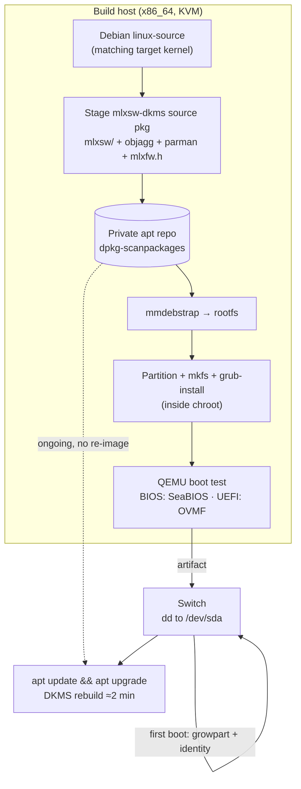
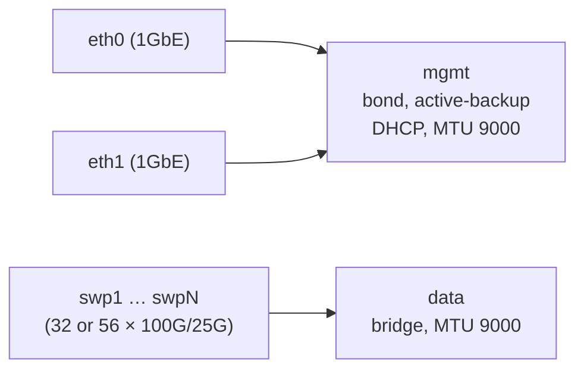

# mlnx — Architecture

An open-source Debian image builder for Mellanox Spectrum-ASIC switches.

**Status:** design reset, 2026-08-01. Debian 12 is proven in the field on
SN2410 and SN2700. This document describes the architecture for the Debian 13
(trixie) rebuild, and records the hardware evidence behind each decision.

---

## 1. Purpose and scope

Take retired, formerly Cumulus-licensed Mellanox enterprise switches and run
pure upstream Debian on them, with a build process that is repeatable,
scriptable, and maintainable as open source.

**In scope**

- Producing a bootable Debian image containing the `mlxsw` switchdev drivers
- Both **BIOS** and **UEFI** boot paths
- Automated OS configuration (console, networking, sensors, SSH)
- A kernel/driver upgrade path that does **not** require re-imaging

**Out of scope (for now)**

- Control-plane routing software (FRR, BGP) — the image is a foundation
- Switch firmware (ASIC) updates
- Multi-distro support. Debian-specific mechanisms (`mmdebstrap`, `dpkg`,
  DKMS) are used deliberately; portability to RHEL/Arch is a non-goal.

## 2. Target hardware

| Model | ASIC | PCI ID | Ports | Boot | Status |
|---|---|---|---|---|---|
| SN2410 (MSN2410-BB2FC) | Spectrum | `15b3:cb84` | 48×25G + 8×100G (56 `swp`) | BIOS | ✅ in service |
| SN2700 (MSN2700) | Spectrum | `15b3:cb84` | 32×100G | BIOS | ✅ in service |
| SN3700C | Spectrum-2 | `15b3:cf6c` | 32×100G | UEFI (believed) | ⏳ untested |

All units share the same CPU complex: **Intel Celeron 1047UE @ 1.40 GHz,
2 cores, 7.9 GB RAM, 512 GB SATA SSD.** This is the build target for any
on-switch compilation, and it is slower than it looks — but see §4.1.

A single `mlxsw_spectrum` build covers the whole fleet: the driver registers
PCI aliases for `cb84` (Spectrum), `cf6c` (Spectrum-2), `cf70` (Spectrum-3)
and `cf80` (Spectrum-4). Port-count differences are absorbed entirely by a
`Name=swp*` glob in the network config — no per-model image is needed.

## 3. The central constraint

**Debian does not ship the mlxsw driver.** Every stock Debian kernel carries:

```
# CONFIG_MLXSW_CORE is not set
```

Verified two ways: on the live SN2700's `/boot/config-6.1.0-51-amd64`, and in
Debian's current `debian/latest` packaging branch on salsa — so this is not a
bookworm-era quirk and it will still be true for trixie.

Everything mlxsw *depends* on, however, Debian already enables:

```
CONFIG_NET_SWITCHDEV=y          CONFIG_NET_DEVLINK=y
CONFIG_BRIDGE_VLAN_FILTERING=y  CONFIG_PSAMPLE=m
CONFIG_VLAN_8021Q=m             CONFIG_VXLAN=m
CONFIG_NET_IPGRE=m              CONFIG_IPV6_GRE=m
CONFIG_MLXFW=m                  CONFIG_PTP_1588_CLOCK=y
```

The only additional gaps are `objagg` and `parman` — `lib/` helpers that
Debian omits because *only* mlxsw selects them.

**Therefore: producing mlxsw is a mandatory, first-class stage of the
pipeline.** Every architectural decision below follows from this one fact.

## 4. Architecture decisions

### AD-1 — Driver delivery by DKMS, not a forked kernel

**Decision.** Ship stock Debian kernels untouched. Deliver mlxsw as a DKMS
source package that rebuilds against whatever kernel `apt` installs.

**Rejected alternative.** Rebuilding Debian's kernel with `MLXSW_*` enabled
(the Debian 12 approach, producing `6.1.85-mlnx`). It works, but it forks the
kernel: every Debian security update must be re-forked by hand, and in
practice the fork froze at `6.1.85` while Debian moved to `6.1.177`.

**Evidence.** Tested end to end on `mlnx-2700-cameo`, 2026-08-01:

| Check | Result |
|---|---|
| Builds OOT against stock kernel headers | ✅ **zero source patches** |
| Clean build, `-j2`, on the switch itself | **1 m 47 s** |
| Unresolved symbols (modpost vs stock `Module.symvers`) | none |
| Modules load on stock `6.1.0-51-amd64` | ✅ all 7 |
| `swp*` interfaces, driver-bound to `mlxsw_spectrum` | ✅ 32/32 |
| devlink / switchdev offload live | ✅ per-port lanes reported |
| Thermal + fan control (`MLXSW_CORE_THERMAL`) | ✅ 2 fans |
| Bond, bridge, addressing after reboot | ✅ 36 links configured |

The 1 m 47 s figure is the load-bearing one: it makes an automatic rebuild on
every `apt upgrade` completely unremarkable. The intuition that "the switch is
too slow to build drivers" conflates this with a *kernel* build — mlxsw is
49 `.c` files and ~67 k lines, not 30 000 files.

**Status: DEPLOYED (2026-08-01).** `mlxsw-dkms_6.1.177-1_all.deb` (338 KB) is
built and installed on both live switches. The forked `6.1.85-mlnx` kernel is
removed and unheld on each; GRUB defaults to the newest stock kernel; and
`/etc/kernel/postinst.d/dkms` plus `AUTOINSTALL="yes"` mean a future kernel
install rebuilds mlxsw automatically. Rollback debs are staged at
`/opt/packages/` on both switches, so reverting needs no network.

| | SN2700 | SN2410 |
|---|---|---|
| kernel | stock `6.1.0-51-amd64` | stock `6.1.0-51-amd64` |
| apt holds | 0 | 0 |
| `swp` ports / bridged | 32 / 32 | 56 / 56 |
| DKMS rebuild time | 1 m 47 s | 1 m 52 s |
| failed units | 0 | 0 |

Package generator: `scripts/mk-mlxsw-dkms.sh`. Built artifact:
`mlnx-switch-packages/dkms/`.

The source snapshot is pinned to the **6.1 kernel series**. It rebuilds across
bookworm's 6.1.x updates, but a series bump (6.1 → 6.12) requires re-extracting
from the matching `linux-source` and re-cutting the package.

**Consequences.**

- Debian security updates flow normally; the driver follows the kernel.
- Cost: ~78 MB of kernel headers and ~500 MB of build tooling resident on each
  switch. Irrelevant against a 512 GB SSD (see AD-4).
- Risk: a failed rebuild yields a kernel with no switch ports. Mitigated —
  management is a bond over *stock* NIC drivers, so SSH always survives, and
  the previous kernel remains installed and bootable.
- Modules are unsigned and out-of-tree (taint bits 12 + 13). **This blocks
  Secure Boot**; see §8.

### AD-2 — A private apt repository is the delivery channel

**Decision.** Publish `mlxsw-dkms` (and any custom packages) from an apt repo
the switches subscribe to.

**Rationale.** This is what actually retires re-imaging, and it is needed
regardless of AD-1. Re-imaging was never a consequence of building a custom
kernel — a kernel `.deb` installs into `/boot` and runs `update-grub` like any
package. The real gap was that there was nowhere to `apt install` *from*.

Two-thirds of this already exists: `assets/setup.sh` builds a local repo
(`deb [trusted=yes] file:/opt/packages/ ./`) and `assets/update.sh` regenerates
its indices with `dpkg-scanpackages`. The change is to promote it from a
throwaway `file:` repo to a published, signed HTTP repo.

> The live switches already prove multi-kernel coexistence: the SN2410 has
> seven kernel packages installed side by side, with `/boot` on the root
> filesystem, so there is no small boot partition to overflow.

### AD-3 — Image assembly with mmdebstrap, not debian-installer

**Decision.** Build the root filesystem directly with `mmdebstrap` into a
loopback image. Use QEMU only to **boot-test** the finished artifact.

**Rejected alternative.** Driving `debian-installer` under QEMU with a preseed
file (the direction `deb12_image_builder.sh:init_image_net_bios()` was heading,
with its `url=…/selections.txt` + `checksum=`). It is legitimate, but it is
slow, timing-sensitive, and debugged through a serial console.

**Consequences.**

- No console automation problem to solve. There is no interactive installer.
- Deterministic and CI-able; minutes rather than tens of minutes.
- The custom `mlxsw-dkms` package is installed as a *package* from the repo in
  AD-2, not copied in by hand.
- **`grub-install` must run inside the target chroot**, using Debian's own
  grub — never the build host's (Arch). Mixing bootloader versions across
  distributions is a classic source of silent breakage.

### AD-4 — Small image, grown on first boot

**Decision.** Build a lean (~8 GB) image. A oneshot systemd unit runs
`growpart` + `resize2fs` on first boot to fill whatever disk it landed on,
then disables itself.

**Rationale.** `dd` time is proportional to image size, and target disks vary.
Today the fleet wastes ~98% of its storage: both switches ran 6.9 GB
filesystems on 512 GB SSDs, and the manual fix is a `sgdisk` sequence
surviving only as a comment block in `deb12_image_builder.sh:118-134`.

> Applied to `mlnx-2700-cameo` on 2026-08-01: `resize2fs` grew it from
> 6.9 G → 469 G online, no reboot. `mlnx-2410-cameo` still needs a partition
> grow first because its partition really is 7 GB.

### AD-5 — One generic image per boot mode; identity at first boot

**Decision.** Produce exactly two artifacts — BIOS and UEFI — with no
per-switch identity baked in. Hostname, MAC addresses and addressing are
derived at first boot (DHCP, DMI product name/serial).

**Rationale.** The current configs hardcode MACs
(`22-mgmt-bond.network`: `36:d5:b1:94:cb:52`, `32-data.network`:
`7c:fe:90:ff:92:7d`). That works for exactly one switch; ship it to two and
they collide on the same L2 segment.

## 5. Build pipeline



The dotted edge is the point of the whole design: once a switch is imaged, it
never needs imaging again. Kernel and driver updates arrive through apt.

## 6. Runtime network model

Two independent planes, both already proven in the field:



- **Management plane** — an `active-backup` bond over the two 1 GbE ports.
  Critically, these use *stock in-tree NIC drivers*, so management survives any
  mlxsw failure. This is what makes AD-1's risk acceptable.
- **Data plane** — all `swp*` ports enslaved to a `data` bridge, matched by
  glob so 32-port and 56-port models share one config.
- Port naming comes from a udev rule keying on the driver:
  `SUBSYSTEM=="net", DRIVERS=="mlxsw_spectrum*", NAME="sw$attr{phys_port_name}"`.

## 7. The mlxsw-dkms package specification

Fully determined by the 2026-08-01 experiment. The package ships **2.7 MB** of
source and requires **no patches**:

| Component | Source | Why |
|---|---|---|
| `drivers/net/ethernet/mellanox/mlxsw/*` | linux-source | the driver, 49 `.c` files |
| `lib/objagg.c`, `lib/parman.c` | linux-source | Debian omits them; only mlxsw selects them |
| `include/linux/{objagg,parman}.h` | linux-source | absent from the headers package |
| `include/trace/events/objagg.h` | linux-source | `objagg.c` does `#define CREATE_TRACE_POINTS` |
| `mlxfw.h` | linux-source | mlxsw does `#include "../mlxfw/mlxfw.h"`; Debian ships the `.ko` but not the header |

Plus config macros, because `CONFIG_MLXSW_*` is absent from the stock kernel's
`autoconf.h`, so the driver's `IS_ENABLED()` guards would silently compile out:

```make
ccflags-y += -I$(src)/include \
  -DCONFIG_MLXSW_CORE_MODULE=1 -DCONFIG_MLXSW_PCI_MODULE=1 \
  -DCONFIG_MLXSW_I2C_MODULE=1  -DCONFIG_MLXSW_SPECTRUM_MODULE=1 \
  -DCONFIG_MLXSW_MINIMAL_MODULE=1 \
  -DCONFIG_MLXSW_CORE_HWMON=1  -DCONFIG_MLXSW_CORE_THERMAL=1 \
  -DCONFIG_MLXSW_SPECTRUM_DCB=1 \
  -DCONFIG_OBJAGG_MODULE=1     -DCONFIG_PARMAN_MODULE=1
```

Resulting modules: `mlxsw_core`, `mlxsw_pci`, `mlxsw_i2c`, `mlxsw_spectrum`,
`mlxsw_minimal`, `objagg`, `parman`. Autoloading works via the PCI alias.

## 8. Open risks

| # | Risk | Status |
|---|---|---|
| R1 | **Trixie's 6.12 kernel is unproven.** The DKMS proof was 6.1-against-6.1. Zero patches were needed there, so risk reads low-to-moderate — but that is an estimate. | Must re-run the test on 6.12 **before** committing this architecture |
| R2 | **Secure Boot vs unsigned modules.** OOT modules set taint bits 12+13. If the SN3700C's UEFI path wants Secure Boot on, MOK enrollment or module signing is required. | Decide before designing the UEFI image |
| R3 | **SN3700C entirely untested** — Spectrum-2 silicon, UEFI boot, no unit yet imaged. | Blocked on hardware time |
| R4 | **Boot-with-no-ports** if a DKMS rebuild fails after a kernel upgrade. | Mitigated by stock-driver management plane + retained previous kernel; wants an explicit GRUB fallback policy |
| R5 | **No automated verification exists.** Every result in this document was obtained by hand. | §9 |

## 9. Verification strategy

Currently manual. The target is a boot-test harness that runs in QEMU against
every built artifact and asserts:

1. The image boots to a login prompt on serial console (both BIOS and UEFI).
2. `mlxsw_spectrum` loads — verifiable in QEMU only up to module load, since
   there is no emulated Spectrum ASIC. Full port enumeration requires hardware.
3. First-boot growth ran and the root filesystem filled the disk.
4. Identity derivation produced a unique hostname and no hardcoded MACs.
5. `systemctl --failed` is empty.

Hardware-only assertions (port count, devlink, thermal) stay a documented
manual checklist against a live switch.

## 10. Known defects in the current tree

Verified 2026-08-01, all still unfixed. These are inherited from the Debian 12
process and should not be carried into the Trixie rebuild:

| Location | Defect |
|---|---|
| `assets/setup.sh:52` | A stray `gg`. With `set -e` at the top, the script aborts here — so `systemctl enable systemd-networkd` and `systemd-resolved` (lines 53–54) **never run**. |
| `assets/etc.systemd.network/24-mgmt-bond.network` | Two `[Match]`/`[Network]` pairs in one file. systemd *merges* duplicate sections, so last-wins silently discards `Bond=mgmt-bond` (which names a nonexistent netdev) and `PrimarySlave=true`. Enslavement works by accident; active-backup never gets its primary. Should be two files. |
| `22-mgmt-bond.network`, `32-data.network` | Hardcoded MAC addresses — see AD-5. |
| `build.image.sh:3`, `deb12_image_builder.sh:3` | `LOCAL_IP` derives from a `br0` bridge that does not exist on the current build host; yields an empty string silently. |
| repo root | 34 GB `deb12_image_builder_bios.img`, 1 GB `test.img`, 791 MB Trixie ISO, 825 MB `-dbg` deb — all untracked, with `*.deb` routed through LFS. `.gitignore` covers only AI-tool files. |
| both scripts | Function dispatch is by commenting/uncommenting the last few lines. Should be argument-driven. |

## Appendix — measurements, 2026-08-01

All from `mlnx-2700-cameo` (MSN2700, Celeron 1047UE @ 1.40 GHz, 2 cores):

```
OOT mlxsw clean build, -j2      1 m 47 s wall  (3 m 17 s CPU)
mlxsw source                    49 .c files, 67 342 lines, 2.7 MB
kernel headers on disk          78 MB
build tree (peak)               114 MB
build-essential et al           ~500 MB
root fs after resize2fs         469 G  (4.5 G used)

modules built:
  mlxsw_spectrum.ko  28.8 MB      mlxsw_core.ko       5.2 MB
  mlxsw_pci.ko        1.0 MB      mlxsw_minimal.ko  654 KB
  mlxsw_i2c.ko      584 KB        objagg.ko         710 KB
  parman.ko         149 KB

runtime on stock 6.1.0-51-amd64:
  32/32 swp ports bound to mlxsw_spectrum
  devlink pci/0000:03:00.0 — per-port lanes/splittable reported
  mlxsw-pci-0300: fan1 6239 RPM, fan2 5315 RPM
  taint 12288 (bit 12 out-of-tree, bit 13 unsigned) — expected
  36 links configured, 0 failed units
```

Note: stock 6.1.177 mlxsw detects **two** fans where the forked 6.1.85 build
reported only one — a small correctness win from tracking Debian's kernel.
