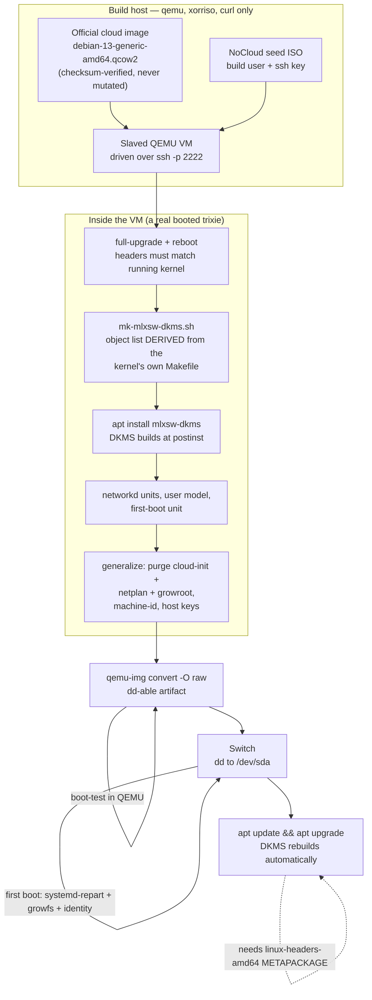
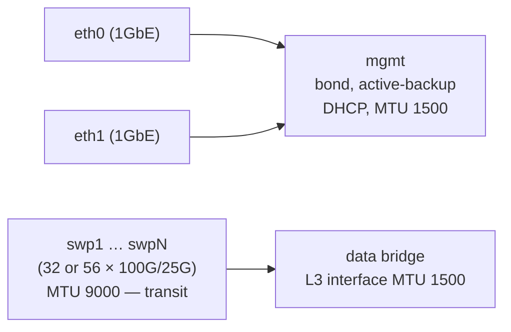

# mlnx-sw-os — Architecture

An open-source Debian image builder for Mellanox Spectrum-ASIC switches.

**Status:** 2026-08-02. Debian 12 is proven in the field on SN2410 and SN2700.
The Debian 13 (trixie) driver path is now **proven up to module load**: mlxsw
builds out-of-tree against trixie's 6.12.100 with **zero source patches**, and
the resulting DKMS package installs and loads under QEMU. Port enumeration
remains a hardware-only assertion.

The image-pipeline design was decomposed and adversarially reviewed on
2026-08-02, which reversed several decisions recorded here. **Where a section
below is marked superseded, the superseding text is authoritative** — the
original is retained only so the reasoning is not lost.

This document describes the architecture for the trixie rebuild and records the
evidence behind each decision.

---

## 1. Purpose and scope

Take retired, formerly Cumulus-licensed Mellanox enterprise switches and run
pure upstream Debian on them, with a build process that is repeatable,
scriptable, and maintainable as open source.

**In scope**

- Producing a bootable Debian image containing the `mlxsw` switchdev drivers
- Both **BIOS** and **UEFI** boot paths
- Automated OS configuration (console, networking, sensors, SSH)
- A kernel/driver upgrade path that does **not** require re-imaging

**Out of scope (for now)**

- Control-plane routing software (FRR, BGP) — the image is a foundation
- Switch firmware (ASIC) updates
- An Arch-based switch OS **as a deliverable**. Debian is the target and the
  only distro that will be built and tested.

**But not multi-distro *capability*.** Reversed 2026-08-01. The pipeline
confines distro-specific logic to a base-image URL and the package-install
commands, so a rolling Arch base stays reachable without a rewrite. That
constraint is the reason the builder is not written around a Debian-only
bootstrapper — see AD-3.

## 2. Target hardware

| Model | ASIC | PCI ID | Ports | Boot | Status |
|---|---|---|---|---|---|
| SN2410 (MSN2410-BB2FC) | Spectrum | `15b3:cb84` | 48×25G + 8×100G (56 `swp`) | BIOS | ✅ in service |
| SN2700 (MSN2700) | Spectrum | `15b3:cb84` | 32×100G | BIOS | ✅ in service |
| SN3700C | Spectrum-2 | `15b3:cf6c` | 32×100G | UEFI (believed) | ⏳ untested |

All units share the same CPU complex: **Intel Celeron 1047UE @ 1.40 GHz,
2 cores, 7.9 GB RAM, 512 GB SATA SSD.** This is the build target for any
on-switch compilation, and it is slower than it looks — but see §4.1.

A single `mlxsw_spectrum` build covers the whole fleet: the driver registers
PCI aliases for `cb84` (Spectrum), `cf6c` (Spectrum-2), `cf70` (Spectrum-3)
and `cf80` (Spectrum-4). Port-count differences are absorbed entirely by a
`Name=swp*` glob in the network config — no per-model image is needed.

## 3. The central constraint

**Debian does not ship the mlxsw driver.** Every stock Debian kernel carries:

```
# CONFIG_MLXSW_CORE is not set
```

Verified two ways: on the live SN2700's `/boot/config-6.1.0-51-amd64`, and in
Debian's current `debian/latest` packaging branch on salsa — so this is not a
bookworm-era quirk and it will still be true for trixie.

Everything mlxsw *depends* on, however, Debian already enables:

```
CONFIG_NET_SWITCHDEV=y          CONFIG_NET_DEVLINK=y
CONFIG_BRIDGE_VLAN_FILTERING=y  CONFIG_PSAMPLE=m
CONFIG_VLAN_8021Q=m             CONFIG_VXLAN=m
CONFIG_NET_IPGRE=m              CONFIG_IPV6_GRE=m
CONFIG_MLXFW=m                  CONFIG_PTP_1588_CLOCK=y
```

The only additional gaps are `objagg` and `parman` — `lib/` helpers that
Debian omits because *only* mlxsw selects them.

**Therefore: producing mlxsw is a mandatory, first-class stage of the
pipeline.** Every architectural decision below follows from this one fact.

## 4. Architecture decisions

### AD-1 — Driver delivery by DKMS, not a forked kernel

**Decision.** Ship stock Debian kernels untouched. Deliver mlxsw as a DKMS
source package that rebuilds against whatever kernel `apt` installs.

**Rejected alternative.** Rebuilding Debian's kernel with `MLXSW_*` enabled
(the Debian 12 approach, producing `6.1.85-mlnx`). It works, but it forks the
kernel: every Debian security update must be re-forked by hand, and in
practice the fork froze at `6.1.85` while Debian moved to `6.1.177`.

**Evidence.** Tested end to end on `mlnx-2700-cameo`, 2026-08-01:

| Check | Result |
|---|---|
| Builds OOT against stock kernel headers | ✅ **zero source patches** |
| Clean build, `-j2`, on the switch itself | **1 m 47 s** |
| Unresolved symbols (modpost vs stock `Module.symvers`) | none |
| Modules load on stock `6.1.0-51-amd64` | ✅ all 7 |
| `swp*` interfaces, driver-bound to `mlxsw_spectrum` | ✅ 32/32 |
| devlink / switchdev offload live | ✅ per-port lanes reported |
| Thermal + fan control (`MLXSW_CORE_THERMAL`) | ✅ 2 fans |
| Bond, bridge, addressing after reboot | ✅ 36 links configured |

The 1 m 47 s figure is the load-bearing one: it makes an automatic rebuild on
every `apt upgrade` completely unremarkable. The intuition that "the switch is
too slow to build drivers" conflates this with a *kernel* build — mlxsw is
49 `.c` files and ~67 k lines, not 30 000 files.

**Status: DEPLOYED (2026-08-01).** `mlxsw-dkms_6.1.177-1_all.deb` (338 KB) is
built and installed on both live switches. The forked `6.1.85-mlnx` kernel is
removed and unheld on each; GRUB defaults to the newest stock kernel; and
`/etc/kernel/postinst.d/dkms` plus `AUTOINSTALL="yes"` mean a future kernel
install rebuilds mlxsw automatically. Rollback debs are staged at
`/opt/packages/` on both switches, so reverting needs no network.

⚠ That `/opt/packages/` directory is **existing fleet state, not part of the
image.** The trixie artifact ships **no local repo and no `.deb` files at all**
(ruled 2026-08-02, see AD-2) — DKMS rebuilds from source on every kernel
upgrade, so a frozen binary rollback package covers a failure mode the
userspace recovery ladder already handles. Nothing in that ruling touches the
deployed switches.

| | SN2700 | SN2410 |
|---|---|---|
| kernel | stock `6.1.0-51-amd64` | stock `6.1.0-51-amd64` |
| apt holds | 0 | 0 |
| `swp` ports / bridged | 32 / 32 | 56 / 56 |
| DKMS rebuild time | 1 m 47 s | 1 m 52 s |
| failed units | 0 | 0 |

Package generator: `scripts/mk-mlxsw-dkms.sh`. Built artifact:
`mlnx-switch-packages/dkms/`.

**Status on trixie: PROVEN, 2026-08-01.** The series bump was carried out and
the zero-patch property holds:

| Check on trixie `6.12.100+deb13-amd64` | Result |
|---|---|
| Builds OOT against stock trixie headers | ✅ **zero source patches** |
| Compiler errors / warnings | 0 / 0 |
| `modpost` undefined symbols | none — silent |
| Modules produced | 7 of 7, vermagic exact incl. `+deb13` |
| DKMS build at `postinst`, `modprobe`, taint 12+13 | ✅ (see §9) |

Zero patches was **verified, not asserted**: `diff -rq` between Debian's
shipped `drivers/net/ethernet/mellanox/mlxsw/` and the packaged tree reports no
content differences. AD-1's load-bearing rationale therefore survives the
series bump — there is no patch queue, so the argument that DKMS beats a
kernel fork is unchanged.

The object list is no longer transcribed by hand. `scripts/mk-mlxsw-dkms.sh`
**derives** it from the kernel's own shipped `Makefile`, and
`tests/test-derive.sh` regression-tests the derivation against the package
deployed on the live fleet. The source snapshot still tracks a kernel series,
so a series bump still means re-running the generator against the matching
`linux-source` — but the list itself cannot silently go stale.

🔴 **DKMS delivery has a hard prerequisite: the `linux-headers-amd64`
METAPACKAGE must be installed — never a versioned
`linux-headers-<uname -r>`.** See R4; this was demonstrated to fail, silently,
in exactly the way that leaves a switch with no ports.

**Consequences.**

- Debian security updates flow normally; the driver follows the kernel.
- Cost: ~78 MB of kernel headers and ~500 MB of build tooling resident on each
  switch. Irrelevant against a 512 GB SSD (see AD-4).
- Risk: a failed rebuild yields a kernel with no switch ports. Mitigated —
  management is a bond over *stock* NIC drivers, so SSH always survives, and
  the previous kernel remains installed and bootable.
- Modules are unsigned and out-of-tree (taint bits 12 + 13). **This blocks
  Secure Boot**; see §8.

### AD-2 — A private apt repository is the delivery channel

**Decision.** Publish `mlxsw-dkms` (and any custom packages) from an apt repo
the switches subscribe to.

**Rationale.** This is what actually retires re-imaging, and it is needed
regardless of AD-1. Re-imaging was never a consequence of building a custom
kernel — a kernel `.deb` installs into `/boot` and runs `update-grub` like any
package. The real gap was that there was nowhere to `apt install` *from*.

> The live switches already prove multi-kernel coexistence: the SN2410 has
> seven kernel packages installed side by side, with `/boot` on the root
> filesystem, so there is no small boot partition to overflow.

🔴 **The local `file:` repo is NOT the seed for this — it is dropped.** Ruled
2026-08-02. `assets/setup.sh` built one
(`deb [trusted=yes] file:/opt/packages/ ./`, regenerated by `assets/update.sh`
with `dpkg-scanpackages`), and the earlier plan was to promote it. It is not
free to carry:

- **It does not port to trixie.** The base uses deb822
  `/etc/apt/sources.list.d/debian.sources`, so writing `/etc/apt/sources.list`
  **adds** a second source set rather than replacing one — and `setup.sh:51`'s
  disabling `sed` edits a file that is not the active source.
- `[trusted=yes]` on a shipped image is an **unsigned-source hole** that was
  being inherited rather than chosen.
- Its original purpose is superseded by AD-1: DKMS rebuilds from source on
  every kernel upgrade.

AD-2 stands on its own as a **published, signed HTTP repo**. Do not conflate
the two — dropping the local file repo does not drop AD-2.

**Version scheme.** 🔴 **Rewritten 2026-08-02 (iter 23): bookworm is dropped
from image generation, so the three-layer cross-suite design below collapsed to
a single floor.** Superseded text is struck rather than deleted, because this
decision has already been reversed more than once and the reasoning is what
stops another round.

~~**Version scheme — three layers, and only two of them are safety.** A version
suffix does **not** make cross-suite upgrades safe: every single version axis is
totally ordered, so `6.12.100-1 gt 6.1.177-1`, `1.0-1~deb13u1 gt 1.0-1~deb12u1`
and `1.0-1+deb13u1 gt 1.0-1+deb12u1` are all TRUE.~~ The arithmetic is still
correct, but the framing is void: **there is no second suite's package**, so
there is no cross-suite upgrade to be offered. The suffix is legibility and
forensics — with one exception noted below.

| Layer | Mechanism | Status |
|---|---|---|
| ~~1~~ | ~~per-suite `dists/bookworm` and `dists/trixie`~~ | **VOID** — a single `dists/trixie` is published |
| 2 | version-constrained `Depends: linux-headers-amd64` | ⚠ **only the bookworm half dies** — see below |
| 3 | honest version: `mlxsw-dkms_6.12.100-1+deb13u1` | ✅ **retained**, and the `+` is load-bearing |

⚠ **Layer 2 was symmetric, and only half of it is void.** It specified
`(>= 6.12)` on the trixie build **and** `(>= 6.1, << 6.12)` on the bookworm
build. Only the bookworm **ceiling** is gone. The trixie constraint survives and
is now simply called **the floor**:

```
Depends: dkms (>= 2.1.0.0), build-essential, linux-headers-amd64 (>= 6.12)
```

Promoting headers from `Recommends` to `Depends` is required anyway (a
`Recommends` does not guarantee a toolchain: trixie's `dkms` 3.2.2 carries
`gcc | c-compiler` in **Recommends**, not `Depends`, so a
`--no-install-recommends` install resolves cleanly and then fails at
`postinst`). Measured, `linux-headers-amd64` is `6.1.177-1` on bookworm against
`6.12.100-1` on trixie, so `(>= 6.12)` is **unsatisfiable on bookworm** — which
is exactly why the floor is kept: it makes a hand-copied trixie deb **refuse**
to install on the two live bookworm switches. Hand-copy is how both were
installed, so that path is real.

### 🔴 A FLOOR, NEVER A CEILING

Standing rule, installed by the iter-23 ruling. `>=` is compatible with
self-maintenance because headers only ever move up. A `<<` upper bound breaks
self-maintenance at the next kernel series bump, and it breaks it by making apt
**REMOVE** the package — leaving a switch on a new kernel with no mlxsw modules
*and no package left to rebuild them*. **Never write an upper bound on
`linux-headers-amd64` in this project.**

🔴 **Use `+debNuN`, never `~debNuN`.** `~` sorts *below* the un-suffixed
version. This is **load-bearing, not cosmetic**: the frozen
`mlxsw-dkms_6.12.100-1_all.deb` is fully installable and was hand-installed in
the build VM, so `6.12.100-1+deb13u1 gt 6.12.100-1` is **TRUE** (offered as an
upgrade) while `6.12.100-1~deb13u1 gt 6.12.100-1` is **FALSE** (never offered).
⚠ Consequence of versioning on the source vintage: a packaging-only re-cut has
nowhere to go but `+deb13u2`. The independent `1.0-1` axis is foreclosed.

### ~~🔴 Dist-upgrade procedure — ADD THE SUITE FIRST~~ — VOID

🔴 **Struck 2026-08-02 (iter 23). Do not implement this procedure.**

> ~~Ruled 2026-08-02. The bookworm package hard-depends on
> `linux-headers-amd64 (<< 6.12)` while Layer 1 puts only that host's own suite in
> its sources. **Compose them and a dist-upgrade removes `mlxsw-dkms`:** the
> installed package becomes unsatisfiable, its trixie replacement is not in
> sources, and apt's only resolution is removal… **Procedure, mandatory:** add the
> target suite to the switch's apt sources; `apt update`; only then upgrade the
> kernel / headers. ⚠ The residual risk is therefore accepted knowingly…~~

**Why it is void.** That failure — "HIGH 1" — was **entirely** a consequence of
the `<< 6.12` ceiling on the bookworm package. No bookworm package is cut, so
there is no ceiling, so the finding, the accepted residual risk, and the
mandatory procedure all die together.

⚠ `/usr/share/doc/mlxsw-dkms/README.Debian` **still ships**, but carries the
DKMS/metapackage rationale and a "never install on pre-trixie" warning instead
of a dist-upgrade procedure.

### The single published artifact

```
mlnx-switch-packages/dkms/mlxsw-dkms_6.12.100-1+deb13u1_all.deb
```

The other two debs in that directory are **frozen reference blobs**, never
installed by any stage: `mlxsw-dkms_6.1.177-1_all.deb` (hardware-proven, the
fixed point of `tests/test-derive.sh` T1) and `mlxsw-dkms_6.12.100-1_all.deb`
(provenance root for the published package). Their sha256s are pinned in the
test harness so a regeneration fails loudly. ⚠ A `*.deb` glob matches all three.

🔴 **No 6.1 package is published, but the 6.1 generation path in
`scripts/mk-mlxsw-dkms.sh` must survive** — T1 derives the 6.1 object list and
compares it against the frozen hardware-proven deb. Delete that path as "dead
code" and the comparison can no longer run.

⚠ **Knowingly unguarded, the reverse direction.** The floor stops
trixie-deb-onto-bookworm. Nothing stops the reverse: the frozen 6.1.177 deb
carries headers only as a `Recommends` and, being frozen, can never gain a
guard — `dpkg -i` onto a trixie switch would build 6.1 source against 6.12
headers. Mitigating: `6.12.100-1+deb13u1 gt 6.1.177-1`, so **apt** prefers the
correct package; only a direct `dpkg -i` bites. Accepted rather than left
silent.

### 🔴 OPEN — how the live fleet reaches trixie

Dropping bookworm defines a target state without a transition plan for the only
two machines in production. **Ruled:** `mlnx-2410-cameo` and `mlnx-2700-cameo`
stay on bookworm with `mlxsw-dkms 6.1.177-1`, untouched, and are **re-imaged**
with the trixie artifact rather than dist-upgraded in place. They already carry
the `linux-headers-amd64` metapackage with `AUTOINSTALL=yes`, so they
self-maintain across 6.1.x point releases in the meantime and are not exposed to
R4.

⚠ **No date, trigger, or owner for that re-image is recorded anywhere.** The
governing rule is *"self-maintaining so long as the upstream distribution is
maintained"* — and Debian 12's regular support window is at or past its end as
of 2026-08 (**verify current status before acting**), which would put both
production switches outside the very condition that rule is conditional on.
Not urgent — DKMS keeps them working regardless — but it is an unclosed
transition, not an oversight to be rediscovered later.

Candidate triggers, none yet chosen: bookworm LTS security-support end;
`boot-test-both-boot-paths` going green; the SN2700's swap-after-root layout
(**not growable in place** — re-imaging fixes it for free) becoming a problem.

### AD-3 — Customize an official cloud image in a slaved VM

**Superseded the mmdebstrap design, 2026-08-01.** The previous decision was to
assemble a root filesystem directly with `mmdebstrap`. It works, but a pipeline
*written around* a distro-specific bootstrapper makes a rolling Arch base
impossible without a rewrite (see §1).

**Decision.** Start from an **official distro cloud image**, boot it under QEMU
with an SSH key injected via a cloud-init **NoCloud** seed ISO, and drive it
over plain `ssh`. Implemented as `scripts/vm.sh`.

An image builder has four layers and only the first is distro-specific:

| Layer | Distro-specific? |
|---|---|
| Obtain a root filesystem | **yes** (`mmdebstrap` / `pacstrap` / …) |
| Install packages, write configs, create users | no — it is a shell session |
| Partition, mkfs, copy, install bootloader | no |
| First-boot growth and identity | no — one systemd unit |

This approach **deletes layer 1** rather than abstracting it. Swapping
Debian → Arch becomes a base-image URL plus different package commands.

🔴 **Use the `generic` variant — NOT `nocloud`, and NOT `genericcloud`.**
Measured 2026-08-01:

| Variant | cloud-init | Drivers | Verdict |
|---|---|---|---|
| `nocloud` | **removed** | virtual-only | **cannot be driven over ssh** — the name means "no cloud-init", not "the NoCloud datasource". Booting it logged zero cloud-init and zero sshd lines and sat at a first-boot prompt until the readiness poll expired; the seed ISO is never read because nothing reads it. |
| `genericcloud` | present | **reduced set, built for VMs** | the artifact is `dd`'d onto *physical* switches — a trimmed driver set is a direct boot risk |
| **`generic`** | present | **full**, bare metal listed as a target | ✅ the only variant satisfying both halves |

Both halves pull in opposite directions: the pipeline needs cloud-init *in the
VM* to inject the build key, and the artifact needs a full driver set *on real
hardware*.

**Consequences.**

- No console automation problem and no interactive installer.
- **Build-host dependencies are QEMU, xorriso and curl.** No bootstrapper, no
  Debian archive keyring on an Arch workstation, no cross-distro packaging
  tooling. (`genisoimage` is not packaged on Arch; `xorrisofs` takes the same
  options.)
- The DKMS build collapses into the pipeline — the VM already has the right
  kernel, headers and toolchain, so the mlxsw package is built and installed
  there rather than as separate scaffolding.
- The bootloader comes from the base image rather than being installed by the
  build host, which disposes of the old hazard of running an Arch `grub-install`
  against a Debian target.

### AD-4 — Small image, grown on first boot

**Decision.** Build a lean (~8 GB) image that grows to fill whatever disk it
landed on at first boot.

🔴 **The growth MECHANISM was reversed three times and is now settled by
measurement: `systemd-repart` (partition) + `x-systemd.growfs` (filesystem).**
See "Growth tooling" below. The *decision* — small image, grown on first boot —
is unchanged; only its implementation is.

**Rationale.** `dd` time is proportional to image size, and target disks vary.
Today the fleet wastes ~98% of its storage: both switches ran 6.9 GB
filesystems on 512 GB SSDs, and the manual fix is a `sgdisk` sequence
surviving only as a comment block in `deb12_image_builder.sh:118-134`.

> Applied to `mlnx-2700-cameo` on 2026-08-01: `resize2fs` grew it from
> 6.9 G → 469 G online, no reboot. `mlnx-2410-cameo` still needs a partition
> grow first because its partition really is 7 GB.

🔴 **Precondition, without which AD-4 cannot work: root must be the LAST
partition on disk, and swap must be a FILE, not a partition.** This is the
binding constraint — installing growth tooling is the easy half.

| | 2410 | 2700 |
|---|---|---|
| layout | `sda1` root, last partition | `sda1` root, **`sda2` swap after it** |
| swap | 2 G swapfile | 961 M partition |
| growable in place? | **yes** | **no** |

The 2700 is 476 G because it was *imaged* that way, not because anything grew
it. The 2410's 2026-08-01 repartition — delete the swap partition and its
extended container, then extend root — was the layout rule being learned the
hard way, not a one-off repair.

**The failure mode is silent.** Ship a swap partition after root and the tool
runs, declines, and you get an 8 GB switch on a 512 GB SSD with nothing in the
logs shaped like an error.

The `generic` base image already satisfies this. ✅ **MEASURED, not asserted**
— `scripts/vm.sh probe` against a guest booted from
`debian-13-generic-amd64.qcow2`:

```
Disklabel type: gpt
/dev/vda1  262144 33554391 33292248 15.9G Linux root (x86-64)
/dev/vda14   2048     8191     6144    3M BIOS boot
/dev/vda15   8192   262143   253952  124M EFI System

sorted by START SECTOR:
14   2048     8191    3M
15   8192   262143  124M
 1 262144 33554391 15.9G root-x86-64
AD-4 precondition: SATISFIED (root is last, growable)
```

Root is `vda1` but starts at sector 262144, *after* `vda14` (bios_grub) and
`vda15` (ESP). Debian numbers them that way on purpose. **Any check that sorts
by partition number rather than start sector reports the wrong answer.**

⚠ Provenance: `vda1` reads 15.9 G because this guest's disk had been resized and
grown during the growth experiments. Partition **ordering** and the
`bios_grub`/ESP **geometry** are unaffected by those operations — those are the
claims this evidence supports. The pristine base ships a ~3 G root.

### Growth tooling — `systemd-repart` + `x-systemd.growfs`

🔴 **Settled 2026-08-02 after three reversals, the last forced by measurement.
Previously recorded here: "`growpart` (from `cloud-guest-utils`) + `resize2fs`
… `systemd-repart` was rejected as GPT-only." Both halves are superseded.**

**cloud-init was never the grower.** Proven by installing a `datasource_list`
drop-in, running `cloud-init clean`, powering off, resizing the disk and booting
with **no seed ISO** (`/var/lib/cloud/seed` verified empty): root grew anyway,
while `cc_growpart` logged **`NOCHANGE`**. The real chain in the base is
`cloud-initramfs-growroot` (partition, from the initramfs) plus
`x-systemd.growfs` (filesystem). Three separate parties drew conclusions about
growth before anyone measured which component did the work — the original
"the base grows itself unprompted" evidence was **confounded** by `vm.sh:213`
attaching a cidata seed.

**Why not `growroot`, which demonstrably works?** It is **Debian-only** — no
equivalent exists in the Arch repos, and it hooks `initramfs-tools`, which Arch
lacks entirely (`mkinitcpio`). Leaning on it would put a distro-specific
dependency into the one layer §1 and AD-3 require to be distro-neutral: the
`mmdebstrap` trap again, invisible until the Arch swap failed with a full disk
and no error. `systemd-repart` and `x-systemd.growfs` are systemd-native on
both distros.

The earlier "GPT-only" rejection of `systemd-repart` was **conditional on the
base's partition label being unmeasured**. The base measured GPT (above), so
that condition lapsed.

```ini
# /etc/repart.d/50-root.conf
[Partition]
Type=root
```

🔴 **No device argument** — `systemd-repart` defaults to the disk backing `/`,
so this is correct on `/dev/vda` in the VM and `/dev/sda` on a switch, with no
branching.

⚠ **`systemd-repart` is a separate package on Debian** (`257.13-1~deb13u1`) and
is **not** in the base image. It must be installed. On Arch it lives inside
`systemd`.

**Proven end to end**, with cloud-init, netplan and growroot all purged and the
disk resized 12 G → 16 G: `systemd-repart` grew `root-x86-64` 11.8 G → 15.8 G
(padding 3.9 G → 0 B), `df` showed 16 G, `/run/systemd/network/` was empty,
`/etc/systemd/network/` was sole authority, and `systemctl --failed` listed
0 units.

**Both previously recorded traps are GONE:**

- ~~"`cloud-guest-utils` is a `Recommends` of `cloud-init`; `apt autoremove`
  will take `growpart` with it"~~ — **this trap never existed.**
  `apt-mark showmanual` proves `cloud-guest-utils` and
  `cloud-initramfs-growroot` are both **manually** marked, so purging cloud-init
  autoremoves neither. It is also moot: `growpart` is not the mechanism.
- ~~"`growpart` exits 1 for both 'no space' and 'no change'; tolerate exit 1 but
  not exit 2"~~ — **that is a `growpart` property.** `systemd-repart` exits **0**
  on no-change, so the entire exit-code branch disappears.

⚠ **Open, cheap, and owned by the generalize stage:** the shipped
`systemd-repart.service` **does** run on a host boot (an earlier claim that it
was initrd-only was wrong; the custom unit merely ran first and did the work).
Establish whether a custom unit is needed on Debian at all, or whether enabling
the shipped one suffices. Do not assume either way.

⚠ **The repart growth path is proven on a virtio disk in QEMU only.** The
switches boot from physical SATA/NVMe; confirm `systemd-repart`'s device
auto-detection there before the fleet relies on it.

**Package budget.** DKMS requires a compiler, kernel headers and kernel source
resident on **every switch**: `linux-headers-*` hard-depends on the kernel
image and on `gcc-14`, and `linux-source-<series>` is a ~149 MB tarball on
trixie. The "lean ~8 GB image" must budget for all of it. This is already true
of the deployed fleet, but it constrains the target rather than being free.

### AD-5 — ONE generic image, both boot modes; identity at first boot

**Decision.** Produce **ONE artifact that boots both BIOS and UEFI**, with no
per-switch identity baked in. Hostname and addressing are derived at first boot
(DMI product name/serial, DHCP).

🔴 **RULED 2026-08-02: one artifact, not one per boot mode.** The earlier
"⚠ *'Two artifacts' may be wrong — it may be one … confirm deliberately*" is
resolved — it is one. Measured (see AD-4): the `generic` base is GPT carrying
**both** a 3 MB `bios_grub` partition and a 124 MB ESP, so a single image boots
BIOS (SN2410/SN2700) *and* UEFI (SN3700C). This narrows R3.

🔴 **The pipeline installs NO bootloader. It asserts one.**
`grub-cloud-amd64` 0.1.1 is **already in the base image**, pulling `grub-pc-bin`,
`grub-efi-amd64-bin`, `grub-efi-amd64-signed` and `shim-signed`, with the ESP
populated at `/boot/efi/EFI/BOOT/BOOTX64.EFI`. Its `postinst` runs
`grub-install` for **both** targets and re-runs on every grub upgrade (a
`triggered` case), so the dual install survives `apt upgrade` — which a
hand-rolled pair does not.

`grub-pc` and `grub-efi-amd64` genuinely **cannot** be co-installed (they
`Conflicts:` each other), which is why this was once recorded as an unsolved
implementation question. It is not: Debian packages the answer. ⚠ A hand-rolled
`grub-install` pair would also have shipped a **non-booting UEFI half**, because
it omits `--no-nvram` (otherwise you write an NVRAM entry on the *build VM*,
meaningless once the image is `dd`'d) and `--force-extra-removable` (without
which `/EFI/BOOT/BOOTX64.EFI` — the removable-media path a freshly imaged
SN3700C with empty NVRAM looks for — is never populated).

**Identity.**

- **Hostname** derives from `/sys/class/dmi/id/*`, which needs no extra package
  — no `smbios-utils`, no `dmidecode`.
- 🔴 **Platform identity comes from `/etc/os-release`, never `uname -r`:**
  `${VERSION_CODENAME:-${VERSION_ID:-${BUILD_ID:-unknown}}}` → `bookworm` /
  `trixie` / `rolling`. The two suites differ in the **format** of the release
  string (`6.12.100+deb13-amd64` vs `6.1.0-51-amd64`), so a regex written
  against one silently fails on the other. `uname -r` is correct **only** for
  naming the kernel a module tree is built against.

**MAC addresses are not derived — they are simply never assigned.** The old
configs pinned them (`22-mgmt-bond.network`: `36:d5:b1:94:cb:52`,
`32-data.network`: `7c:fe:90:ff:92:7d`). Those are `[Link]` **assignments**, not
`[Match]` rules, and they existed only to prop up name-based matching. With the
units matching intrinsically on `Driver=` they have no purpose at all, so **the
lines are deleted** and the kernel derives each netdev's MAC from a member
interface.

🔴 That deletion is load-bearing under one-generic-image: shipping those lines
would assign the **same MAC to every switch** on a segment where `arrakis` holds
~35 permanent static ARP entries.

## 5. Build pipeline



The dotted edge is the point of the whole design: once a switch is imaged, it
never needs imaging again. Kernel and driver updates arrive through apt.

## 6. Runtime network model

Two independent planes, both already proven in the field:



- **Management plane** — an `active-backup` bond over the two 1 GbE ports.
  Critically, these use *stock in-tree NIC drivers*, so management survives any
  mlxsw failure. This is what makes AD-1's risk acceptable.
- **Data plane** — all `swp*` ports enslaved to a `data` bridge, matched by
  glob so 32-port and 56-port models share one config.
- Port naming comes from a udev rule keying on the driver:
  `SUBSYSTEM=="net", DRIVERS=="mlxsw_spectrum*", NAME="sw$attr{phys_port_name}"`.

🔴 **MTU: the bridge's own L3 interface is 1500; `swp*` stay 9000.** Corrected
2026-08-01 — the diagram previously showed 9000 for both, which was wrong and
was live on hardware.

A bridge netdev's MTU is a **host** property, not a switching property. The
`10.10.100.0/22` segment carries ~35 hosts at 1500, and there is no path-MTU
discovery for *on-link* neighbours — a sender simply uses its interface MTU and
transmits. A jumbo `data` interface therefore emitted frames the gateway
physically could not receive, silently. Demonstrated before the fix: a
1472-byte payload passed, 9000 failed.

`swp*` at 9000 is correct and must stay — those are transit ports, and letting
jumbo frames pass through costs nothing.

Raising the *gateway* to jumbo instead would have been far worse: it would put
the other ~33 hosts behind the same blackhole in the reverse direction.

### Default routes — remove eligibility, do not rank it

🔴 **SUPERSEDES the metric-based model previously recorded here** (*"Both planes
must take DHCP route metrics that keep `mgmt` preferred … data is now 1000/2000
(v4/v6), mgmt 500"*). Metrics were the **live hotfix**, not the shipped design.

`mgmt` and `data` sit on the *same* subnet. As originally shipped (data 100,
mgmt 500) the data bridge won egress, SSH arrived on `mgmt` and replied via
`data`, and a routine session became a **286-second blackout** on 2026-08-01.
Raising data's metric to 1000/2000 fixed the live fleet and is still what the
switches run today.

**The image ships a stronger fix: `data` is not eligible for a default route at
all.**

```ini
# 32-data.network
[Network]
DHCP=ipv4
LinkLocalAddressing=ipv4
IPv6AcceptRA=false
MTUBytes=1500

[DHCPv4]
UseRoutes=false
UseGateway=false
```

🔴 **The keys go under `[DHCPv4]`, never `[DHCP]`.** Measured: `[DHCP]` is a
valid legacy compat section and `UseRoutes=` works there, but **`UseGateway=`
does not exist in it** — networkd logs
`Unknown key 'UseGateway' in section [DHCP], ignoring` and drops it. It would
have survived by luck (`UseGateway=` defaults to the value of `UseRoutes=`),
which would have made the management plane's reachability depend on an
undocumented side effect of a silently dropped setting.

**The data bridge is IPv4-only** (ruled 2026-08-02). It previously carried
`IPv6AcceptRA=true`, so it installed an IPv6 default route from any RA on the
segment — entirely outside the `[DHCPv4]` keys above, making "data contributes
no default route" **false on v6**. It also carried `IPv6SendRA=yes` and
`DHCPv6PrefixDelegation=yes`: the data bridge **advertising itself as a router**
onto `10.10.100.0/22`.

**`mgmt` keeps IPv6 addressing but never advertises.** The asymmetry is
deliberate — do not "fix" it:

| Key | `mgmt` | `data` |
|---|---|---|
| `DHCP=` | `yes` (both families) | `ipv4` |
| `IPv6AcceptRA=` | **`true` — kept**; `mgmt` is the plane that *should* hold the default route | `false` |
| `IPv6SendRA=` | **deleted** | **deleted** |
| `DHCPv6PrefixDelegation=` | **deleted** | **deleted** |
| `RouteMetric=` | **deleted** | **deleted** |

Net shape: **exactly one default route per family, both on `mgmt`.** No metric
is asserted anywhere, because nothing needs out-ranking once `data` is
ineligible.

⚠ `DHCPv6PrefixDelegation=` was renamed `DHCPPrefixDelegation=` in systemd 250
and the old name is still accepted — grep for **both** spellings, or an
assertion finds only one.

### Matching is intrinsic — `Driver=`, never `Name=`

The units bind on the driver, not on hand-enumerated interface names. Verified
implementable before adoption: `[Match] Driver=` compares against the udev
property `ID_NET_DRIVER`. Measured on `mlnx-2410-cameo` (systemd 252):

```
swp1, swp2   ID_NET_DRIVER=mlxsw_spectrum
eth0, eth1   ID_NET_DRIVER=e1000e
```

So `34-data.network` matches `Driver=mlxsw_spectrum*` (glob, so a Spectrum-2/3
driver rename on the SN3700C does not silently stop matching) and
`24-mgmt-bond.network` matches `Driver=e1000e`. ⚠ `Name=mgmt` and `Name=data`
remain the **correct** matchers for the two virtual netdevs, which have no
meaningful `ID_NET_DRIVER` — intrinsic matching applies to *physical port
binding* only.

⚠ **The mgmt bond ships with NO primary.** One `Driver=e1000e` unit matches both
management NICs, so it cannot designate a per-member `PrimarySlave=` — the
intrinsic-matching ruling and a bond primary are structurally exclusive.
Active-backup failover is last-carrier-wins. This is already the deployed
behaviour (the old file set `PrimarySlave=false` last, and last wins), so it
introduces no new runtime risk — but `PrimaryReselectPolicy=always` is inert
without a primary and is **deleted** rather than shipped as a policy that does
nothing.

⚠ `Driver=e1000e` matches *any* `e1000e` NIC. On measured hardware that is
exactly the two mgmt ports (`0000:00:19.0`, `0000:06:00.0`), which is what the
bond wants. A third such NIC would be enslaved too; switch to `Path=` then.

🔎 **Search trap.** The udev rule builds the name as `sw` +
`$attr{phys_port_name}` (`sw` + `p1` = `swp1`), so it **never contains the
literal string `swp`**. Grepping for `swp` returns nothing and the rule looks
absent. Search `mlxsw` or `phys_port_name`.

## 7. The mlxsw-dkms package specification

Measured on both kernel series, 2026-08-01. The package requires **no patches**
on either:

| | bookworm 6.1.177 | trixie 6.12.100 |
|---|---|---|
| mlxsw `.c` files | 49 | **50** |
| mlxsw objects | 49 | **50** (`+spectrum_port_range.o`) |
| `.c` + `objagg` + `parman` shipped | 51 | **52** |
| headers shipped | 32 | **33** |
| modules produced | **7** | **7** — unchanged; the new object links into `mlxsw_spectrum.ko` |
| package size | 338 KB | **351 KB** |

The **module count does not change**, so counting modules will never detect a
missing object. Only `modpost` will.

The object list is **derived from the kernel's own `Makefile`**, not
transcribed — see AD-1. Four conditional lines must be honoured, and three of
their four `CONFIG_` symbols are **absent from Debian's config entirely**
(select-only symbols kconfig omits), so a resolver that reads only the kernel
config silently drops `core_hwmon.o` and `core_thermal.o` — the fan and thermal
control:

```make
mlxsw_core-$(CONFIG_MLXSW_CORE_HWMON)       += core_hwmon.o
mlxsw_core-$(CONFIG_MLXSW_CORE_THERMAL)     += core_thermal.o
mlxsw_spectrum-$(CONFIG_MLXSW_SPECTRUM_DCB) += spectrum_dcb.o
mlxsw_spectrum-$(CONFIG_PTP_1588_CLOCK)     += spectrum_ptp.o
```

Only `PTP_1588_CLOCK` comes from the kernel config; the other three resolve
from this package's own `-D` macros.

⚠ **On trixie, modules install compressed as `.ko.xz`**; bookworm ships plain
`.ko`. Any tooling that globs `*.ko` breaks — glob **`*.ko*`**.

Measured on the trixie guest's own `/boot/config-6.12.96+deb13-amd64`:

```
CONFIG_MODULE_COMPRESS=y
# CONFIG_MODULE_COMPRESS_GZIP is not set
CONFIG_MODULE_COMPRESS_XZ=y          <- this is what makes it .ko.xz
# CONFIG_MODULE_COMPRESS_ZSTD is not set
CONFIG_MODULE_COMPRESS_ALL=y         <- separate switch: compress in-tree too
```

An earlier revision cited only `CONFIG_MODULE_COMPRESS_ALL=y`. That symbol *is*
set, but it is not the one that selects the format — **`CONFIG_MODULE_COMPRESS_XZ`
is.** Bookworm's side is confirmed from the committed fixture
`tests/fixtures/config-6.1.0-51-amd64:908`: `CONFIG_MODULE_COMPRESS_NONE=y`,
with `_GZIP`/`_XZ`/`_ZSTD` all unset.

Contents:

| Component | Source | Why |
|---|---|---|
| `drivers/net/ethernet/mellanox/mlxsw/*` | linux-source | the driver, 49 `.c` files |
| `lib/objagg.c`, `lib/parman.c` | linux-source | Debian omits them; only mlxsw selects them |
| `include/linux/{objagg,parman}.h` | linux-source | absent from the headers package |
| `include/trace/events/objagg.h` | linux-source | `objagg.c` does `#define CREATE_TRACE_POINTS` |
| `mlxfw.h` | linux-source | mlxsw does `#include "../mlxfw/mlxfw.h"`; Debian ships the `.ko` but not the header |

Plus config macros, because `CONFIG_MLXSW_*` is absent from the stock kernel's
`autoconf.h`, so the driver's `IS_ENABLED()` guards would silently compile out:

```make
ccflags-y += -I$(src)/include \
  -DCONFIG_MLXSW_CORE_MODULE=1 -DCONFIG_MLXSW_PCI_MODULE=1 \
  -DCONFIG_MLXSW_I2C_MODULE=1  -DCONFIG_MLXSW_SPECTRUM_MODULE=1 \
  -DCONFIG_MLXSW_MINIMAL_MODULE=1 \
  -DCONFIG_MLXSW_CORE_HWMON=1  -DCONFIG_MLXSW_CORE_THERMAL=1 \
  -DCONFIG_MLXSW_SPECTRUM_DCB=1 \
  -DCONFIG_OBJAGG_MODULE=1     -DCONFIG_PARMAN_MODULE=1
```

Resulting modules: `mlxsw_core`, `mlxsw_pci`, `mlxsw_i2c`, `mlxsw_spectrum`,
`mlxsw_minimal`, `objagg`, `parman`. Autoloading works via the PCI alias.

## 8. Open risks

| # | Risk | Status |
|---|---|---|
| R1 | **Trixie's 6.12 kernel is unproven.** | ✅ **Largely closed 2026-08-01.** Builds with zero patches, silent modpost, 7/7 modules with exact vermagic; DKMS builds at `postinst` and `modprobe` succeeds under QEMU. **Remaining:** port enumeration on real silicon, which QEMU cannot test. |
| R2 | **Secure Boot vs unsigned modules.** | **Narrowed twice.** Trixie ships `CONFIG_MODULE_SIG=y` with `MODULE_SIG_FORCE` **unset**, so unsigned OOT modules load and merely taint (12+13). Further, trixie's DKMS now **auto-generates a MOK and signs modules** (`/var/lib/dkms/mok.key`; `modinfo -F signer` → *"DKMS module signing key"*). So enabling Secure Boot is **MOK enrollment**, not building a signing pipeline. ⚠ Each machine generates its **own** key at first install — a fleet image must choose per-switch enrollment or a shared baked key. |
| R3 | **SN3700C entirely untested** — Spectrum-2 silicon, UEFI boot, no unit yet imaged. | Blocked on hardware time. Possibly narrowed: the base image carries both `bios_grub` and an ESP (see AD-5). |
| R4 | **Boot-with-no-ports** after a kernel upgrade. | 🔴 **OBSERVED, not theoretical — 2026-08-01.** Reproduced end to end in the VM (see §9). Mitigated by the stock-driver management plane and the retained previous kernel, and requires the **`linux-headers-amd64` metapackage** (mandatory) plus the **detection-and-recovery ladder** below. 🔴 **A GRUB fallback policy does NOT mitigate R4** — see the detail section; that claim stood here through three review passes and is wrong. |
| R5 | **No automated verification exists.** | **Partly closed.** `tests/test-derive.sh` (23 assertions) and `scripts/mlxsw-premise-audit.sh` (26 assertions, runs against the VM *or* a live switch, read-only) are automated. Image boot-testing is still manual. |
| R6 | 🔴 **Trixie has NO stable kernel ABI number.** Bookworm's `6.1.0-51-amd64` holds across point releases; trixie moved `6.12.94 → .96 → .100` inside this project's own timeline. `uname -r` changes on **every** kernel update, so DKMS rebuilds every time — each one an R4 opportunity. | Open. This is a real argument against AD-1 that did not exist on 6.1 evidence. **Never hardcode a point release** anywhere in the tooling. |

### R4 in detail — the failure that was reproduced

The mechanism, demonstrated in the build VM on 2026-08-01:

1. A system running kernel *N* has only the **versioned**
   `linux-headers-<N>` installed.
2. `apt full-upgrade` installs kernel *N+1*. No matching headers arrive,
   because the versioned package tracks *N* and nothing pulls *N+1*'s.
3. `/etc/kernel/postinst.d/dkms` fires, has nothing to build against, and
   produces nothing. **`apt` exits 0. Nothing warns.**
4. The next reboot selects *N+1*:
   `modprobe mlxsw_spectrum → FATAL: Module not found`.

On a switch that is **no data plane**, reachable only over the management bond,
discovered only by absent ports.

**The fix is a one-word difference and it is mandatory:** install
**`linux-headers-amd64`** — the metapackage — never
`linux-headers-$(uname -r)`. The metapackage tracks `linux-image-amd64`, so
headers arrive in the same transaction as the kernel and DKMS rebuilds
unattended. Verified: installing it triggered an immediate unattended rebuild
and restored `modprobe`.

✅ **The deployed fleet is not exposed** — checked, not assumed. Both switches
carry `linux-headers-amd64` 6.1.177-1 matched to `linux-image-amd64` 6.1.177-1.

🔴 **R6 makes R4 recur.** Trixie has **no stable kernel ABI number** — observed,
not predicted: `6.12.94 → .96 → .100` inside this project's own timeline. So
`uname -r` changes on every kernel update, DKMS rebuilds every time, and each
rebuild is a fresh opportunity for R4. Bookworm's `6.1.0-51-amd64` held across
point releases, so 6.1 evidence never raised this.

### 🔴 R4's mitigation is a USERSPACE ladder — GRUB fallback does NOT apply

Recorded here, in the epic and in a now-retired task as *"an explicit GRUB
fallback policy (no longer optional)"*. **That is a category error, and it
survived three review passes before anyone checked the mechanism against what
R4 actually is.**

GRUB's fallback machinery — `fallback=`, `next_entry`, `prev_saved_entry` —
reacts only to a menu entry whose **boot fails**, i.e. `linux`/`initrd` cannot
be loaded. **R4 boots perfectly and merely lacks modules.** To GRUB that is a
success. **No GRUB-only configuration mitigates R4.**

The THICK image (toolchain and headers resident) makes the first two rungs
possible without a bootloader at all:

| # | Rung | Mechanism |
|---|---|---|
| 1 | **Detect** | a oneshot unit asserts `/lib/modules/$(uname -r)/updates/dkms/mlxsw*.ko*` is non-empty — glob `*.ko*`, trixie ships `.ko.xz` |
| 2 | **Rebuild in place** | `dkms autoinstall` + `modprobe`. The running kernel is fine; only its modules are missing. Data plane returns with **no reboot**. Run async — never block boot |
| 3 | **Fall back** | only if rung 2 fails: arm a `grub-reboot` one-shot to the last known-good kernel and reboot |
| 4 | **Give up loudly** | no known-good recorded: log loudly, **fail the unit**, stay reachable on the management plane. **Never refuse to boot** |

**GRUB's role is reduced to *honouring* the one-shot — it detects nothing.**

Mechanism notes, verified against GRUB 2.12:

- `grub-reboot` needs **neither** `GRUB_DEFAULT=saved` **nor**
  `GRUB_DISABLE_SUBMENU`: `00_header` emits the `next_entry` block in **both**
  branches of its only guard (`GRUB_BUTTON_CMOS_ADDRESS`, unset by default). It
  can address submenu entries as `Submenu>entry id`, which is what the previous
  kernel is.
- `GRUB_DEFAULT=saved` + `GRUB_SAVEDEFAULT=true` **cannot** be used:
  `savedefault` stores `${chosen}` as a bare title that the top-level
  `set default` cannot resolve, and previous kernels live **only** inside the
  Advanced-options submenu.
- ⚠ `00_header` guards `load_env` behind `[ -s $prefix/grubenv ]`, so a missing
  or empty grubenv makes the one-shot **silently no-op**. Assert it.
- **Last-known-good is seeded at image build time** with the shipped kernel, and
  re-written on each verified boot. The concept is meaningless before the first
  upgrade — a freshly `dd`'d image has exactly one kernel and nothing to fall
  back to, which is rung 4.

🔴 **The image never depends on this ladder.** Every released artifact ships
with mlxsw modules built for its own kernel plus the resident toolchain; the
boot-test fails the artifact **offline** if it does not. The ladder is
post-upgrade recovery, never what makes an image work.

## 9. Verification strategy

**Automated today** (no hardware, no network, no VM for the first):

| Harness | Assertions | Scope |
|---|---|---|
| `tests/test-derive.sh` | 23 | The derived object list must reproduce the package deployed on the live fleet, exactly. Also covers the absent-vs-disabled CONFIG trichotomy and hard-fail on unaccounted symbols. |
| `scripts/mlxsw-premise-audit.sh` | 26 | Every premise the packaging depends on, against whatever kernel the machine runs. Read-only, so it runs in the VM **or** against a live switch. Green on 6.12.100 and on the fleet's 6.1.0-51. |
| `scripts/vm.sh {up,provision,probe,audit}` | — | Brings up the slaved VM, reconciles kernel/headers, and records what the guest actually is. |

**Verified by hand in the VM, 2026-08-01** (Phase 3/4 of the trixie proof):
compile clean and modpost silent; 7/7 modules with exact vermagic; DKMS builds
at `postinst`; `modprobe mlxsw_spectrum` pulls `mlxsw_pci`, `mlxsw_core`,
`objagg`, `parman`; taint exactly 12+13; `systemctl --failed` empty; and the R4
upgrade failure reproduced and fixed.

⚠ Note QEMU has **no emulated Spectrum ASIC**, so `mlxsw_pci` binds nothing and
**no `swp*` interfaces appear**. Everything above proves symbol resolution,
module init and the upgrade path — never port enumeration.

Still manual. The target is `scripts/boot-test.sh`, which runs the finished raw
artifact in QEMU **twice — BIOS and UEFI** — and asserts a much larger set.

🔴 **The five-item sketch previously recorded here is superseded.** It specified
assertions with **no way to execute them**: the generalize stage strips the
`builder` user and its key, so the finished artifact has no login, and cloud-init
is purged, so a fresh seed ISO would never be read. Assertions must therefore be
**tiered**, and every assertion labelled with its tier:

| Tier | Mechanism | Covers |
|---|---|---|
| **Offline** | loopback-mount the raw image; no boot | the large majority — package presence, file contents, unit enablement, `fstab`, `/etc/default/grub.d/`, generated `grub.cfg`, ESP contents, absence of netplan/cloud-init, no `MACAddress=` |
| **Serial-log** | boot, parse the serial log, never log in | reaches a login prompt, growth outcome, unit failures |
| **Modified copy** | copy the image, inject a key **offline**, boot the copy | anything needing a live shell: `systemctl --failed`, `networkctl`, `dkms status`, route table. ⚠ This does **not** test the shipped bytes — say so |

**Prefer offline inspection wherever it suffices** — it needs no boot and cannot
be confounded by the harness.

🔴 **No expected-failure allowlist. Ever.** A unit that legitimately cannot
succeed in QEMU must be **conditioned** (`ConditionPathExistsGlob=`), not
allowlisted — a failed `Condition*` marks a unit *skipped*, not *failed*, so
`systemctl --failed` stays clean with nothing muted. The test then asserts the
skip happened for the right reason (`ConditionResult`), which turns a mute
button into a positive assertion. **If a unit needs an allowlist, the unit is
wrong.**

🔴 **Every weakened assertion carries a label and a reason** — `SKIP`,
`NON-DISCRIMINATING`, or `NON-REPRESENTATIVE`. A check that runs and cannot fail
is worse than a skip. Known cases, none of which may print green:

- **Port enumeration into the bridge** — the project's own success criterion —
  is **not verifiable in QEMU**. No ASIC, so `mlxsw_pci` binds nothing and zero
  `swp*` appear. Hardware-only, permanently.
- `mgmt` and `data` have **zero members** in QEMU, so "exactly one default route,
  on `mgmt`" passes identically whether the route model was implemented or not.
  Assert the *config file* instead, and label the runtime check
  NON-DISCRIMINATING.
- `swp*` MTU cannot be observed; `Driver=mlxsw_spectrum*` matches nothing.
- Hostname derivation runs, but QEMU's DMI reports a generic PC — it cannot
  prove a switch-correct name without a synthetic `-smbios`.
- `systemd-networkd-wait-online` **passes** in QEMU, where the single NIC comes
  up — while the stated hazard is a switch with most ports dark.
- `coretemp`/`jc42` are a file check; *loading* them is a SKIP on a q35 vCPU.

⚠ **The UEFI harness must be written from scratch.** `qemu.uefi.sh` is a PXE
netboot script with no disk attached, pointing at a firmware path that does not
exist on this host; no `OVMF_VARS` exists anywhere in the tree; and
`build.image.sh:17` wires **CODE into the varstore slot**. Source both firmware
files from the host package with a preflight, and copy the varstore **fresh per
run** — a persisted varstore makes the run non-repeatable and can cache a stale
boot entry.

⚠ **Poll reboots by a changed `boot_id` or a fresh kernel banner in the serial
log — never by ssh answering**, which can be the *old* boot.

Hardware-only assertions (port count, devlink, thermal) stay a documented manual
checklist against a live switch.

## 10. Known defects in the current tree

Verified 2026-08-01, all still unfixed. These are inherited from the Debian 12
process and should not be carried into the Trixie rebuild:

| Location | Defect |
|---|---|
| `assets/etc.systemd.network/24-mgmt-bond.network` | Two `[Match]`/`[Network]` pairs in one file. systemd *merges* duplicate sections, so last-wins silently discards `Bond=mgmt-bond` (which names a nonexistent netdev) and `PrimarySlave=true`. Enslavement works by accident; active-backup never gets its primary. ⚠ Splitting it into two files is **no longer the fix** — under intrinsic `Driver=` matching one unit matches both NICs, so the bond ships with no primary deliberately (see §6). |
| `22-mgmt-bond.network`, `32-data.network` | Hardcoded MAC addresses — see AD-5. The fix is **deletion**, not derivation. |
| `22-mgmt-bond.network:23` | `MTUBytes=9000` on the **mgmt bond**, on a segment locked at 1500. ⚠ An earlier record had this backwards: it claimed `34-data.network` set the `swp*` MTU. It does not — that file is five lines and sets **no** MTU, so `swp*` at 9000 must be written deliberately. |
| `22-mgmt-bond.network`, `32-data.network` | `IPv6SendRA=yes` + `DHCPv6PrefixDelegation=yes` — both planes advertise themselves as **routers** onto a ~35-host production segment. Inherited configuration, never a decision. See §6. |
| `build.image.sh:3`, `deb12_image_builder.sh:3` | `LOCAL_IP` derives from a `br0` bridge that does not exist on the current build host; yields an empty string silently. |
| both scripts | Function dispatch is by commenting/uncommenting the last few lines. Should be argument-driven. |
| `.gitattributes` | `*.deb` still routes through **LFS**, and this build host has no `git-lfs` installed, with no LFS objects left in the repo. `mlnx-switch-packages/dkms/*.deb` carries an explicit `-filter` override so the DKMS packages are safe — but a `.deb` added **anywhere else** would be claimed by a filter that cannot run. Narrow the pattern or drop it. |

**Struck from this table — the defect does not exist:**

- ~~`assets/setup.sh:52` — a stray `gg`; with `set -e` the script aborts here, so
  `systemctl enable systemd-networkd` / `systemd-resolved` (lines 53–54) never
  run.~~ 🔴 **FALSE.** Verified 2026-08-02: line 52 is **empty**, the file ends
  cleanly at line 54, and both `systemctl enable` lines are present and
  reachable. The claim was recorded here and repeated in two task plans. Do not
  reintroduce it.

**Resolved since this table was written:**

- `assets/kbuild.setup.sh` — **deleted 2026-08-01.** It never specialized the
  image; it prepared a hand-built forked kernel, which AD-1 retired. Its
  package list was harvested first.
- `assets/setup.sh` and `assets/grub.serial.patch` — **both retired** by the
  trixie pipeline (2026-08-02). `setup.sh` still patched `/etc/default/grub`,
  still `rsync`ed the networkd units, and still hardcoded the retired
  `linux-image-6.1.85-mlnx`. The patch's hunk contexts no longer match the
  measured base, so it would fail or fuzz.
  ⚠ **Extract `GRUB_TERMINAL="serial console"` from the patch before deleting
  it.** `grub-mkconfig` expands `GRUB_TERMINAL` into **both**
  `GRUB_TERMINAL_INPUT` and `GRUB_TERMINAL_OUTPUT`, and the base sets only
  `GRUB_TERMINAL_OUTPUT` — so that line is the **only** source of serial
  **input**. Without it a headless switch sees the GRUB menu but cannot steer
  it. An earlier record called the patch "mostly redundant"; it is not.
  ⚠ Do **not** carry forward its `console=ttyS0,115200n8d` (the trailing `d` is
  not a valid flow-control character) or its `biosdevnames=0` (a typo for
  `biosdevname=0`, and inert on Debian either way — it is dropped, not fixed).

**GRUB drop-in contract** (`/etc/default/grub.d/`, sourced *after*
`/etc/default/grub`, so it beats the main file):

| File | Owns |
|---|---|
| `20_switch-cmdline.cfg` | `GRUB_CMDLINE_LINUX` (**append**, never assign), `GRUB_TERMINAL` |
| `25_switch-boot-policy.cfg` | `GRUB_DEFAULT`, `GRUB_TIMEOUT`, `GRUB_TIMEOUT_STYLE` |

Two digits, always — glob order is **lexical, not numeric**, so a `100_` file
would sort *before* `20_`. Both must sort after the base's own `10_cloud.cfg`
and `15_timeout.cfg`.

🔴 **The base's `15_timeout.cfg` sets `GRUB_TIMEOUT=0`**, overriding the `5`
visible in `/etc/default/grub` — so the effective base timeout is **0, and no
menu is displayed at all**. It is **deleted**, not shadowed: leaving two files
disagreeing with the winner decided by filename sort is the same
second-competing-authority shape treated as Critical elsewhere. The shipped
timeout is **≥ 5** with `GRUB_TIMEOUT_STYLE=menu` set explicitly — without the
style key the timeout is decorative.
- `.gitignore` now covers build artifacts (`*.img`, `*.iso`, `*.qcow2`,
  `*.raw`), not just AI-tool files. The rule *"never `git add -A` in this
  repo"* still stands — the tree holds a 34 GB image and a 791 MB ISO.

## Appendix — measurements, 2026-08-01

### Source size, both series

Measured with `scripts/mlxsw-premise-audit.sh` against the shipped
`linux-source` on each machine:

| | bookworm 6.1.177 | trixie 6.12.100 |
|---|---|---|
| `.c` files | 49 | 50 |
| `.h` files | 29 | 29 |
| lines, `.c` only | 65 928 | 68 880 |
| lines, `.c` + `.h` | 85 459 | 88 775 |
| on disk | 2.6 M | 2.7 M |

⚠ **Correction.** An earlier revision of this appendix recorded 6.1 as
"67 342 lines" with **no stated scope**, and that figure is **not
reproducible** — it matches neither 65 928 (`.c`) nor 85 459 (`.c` + `.h`)
against the same `linux-source-6.1` tree the fleet carries. The file count and
size both reproduce exactly, so the discrepancy is confined to the line count;
it was most likely taken from the forked `6.1.85-mlnx` tree. Both scopes are
now stated so the ambiguity cannot recur.

### On-hardware, `mlnx-2700-cameo` (MSN2700, Celeron 1047UE @ 1.40 GHz, 2 cores)

```
OOT mlxsw clean build, -j2      1 m 47 s wall  (3 m 17 s CPU)
kernel headers on disk          78 MB
build tree (peak)               114 MB
build-essential et al           ~500 MB
root fs after resize2fs         469 G  (4.5 G used)

modules built:
  mlxsw_spectrum.ko  28.8 MB      mlxsw_core.ko       5.2 MB
  mlxsw_pci.ko        1.0 MB      mlxsw_minimal.ko  654 KB
  mlxsw_i2c.ko      584 KB        objagg.ko         710 KB
  parman.ko         149 KB

runtime on stock 6.1.0-51-amd64:
  32/32 swp ports bound to mlxsw_spectrum
  devlink pci/0000:03:00.0 — per-port lanes/splittable reported
  mlxsw-pci-0300: fan1 6239 RPM, fan2 5315 RPM
  taint 12288 (bit 12 out-of-tree, bit 13 unsigned) — expected
  36 links configured, 0 failed units
```

Note: stock 6.1.177 mlxsw detects **two** fans where the forked 6.1.85 build
reported only one — a small correctness win from tracking Debian's kernel.

### In the build VM, trixie 6.12.100

```
OOT mlxsw clean build, -j4      11 s      (build-host vCPUs)
DKMS build at apt install       19 s
modules produced                7 (.ko.xz on trixie)
package                         mlxsw-dkms_6.12.100-1_all.deb, 350 884 bytes
taint after modprobe            12288 (bits 12 out-of-tree + 13 unsigned)
swp* interfaces                 0 — QEMU has no Spectrum ASIC
```

⚠ **The 11 s figure is NOT comparable to the fleet's 1 m 47 s.** Different core
count (`-j4` vs `-j2`) and vastly different hardware. AD-1's "a rebuild is
unremarkable" claim rests on the *hardware* measurement, and re-establishing it
on 6.12 requires a switch actually running trixie. Do not quote the VM number
as evidence for it.
